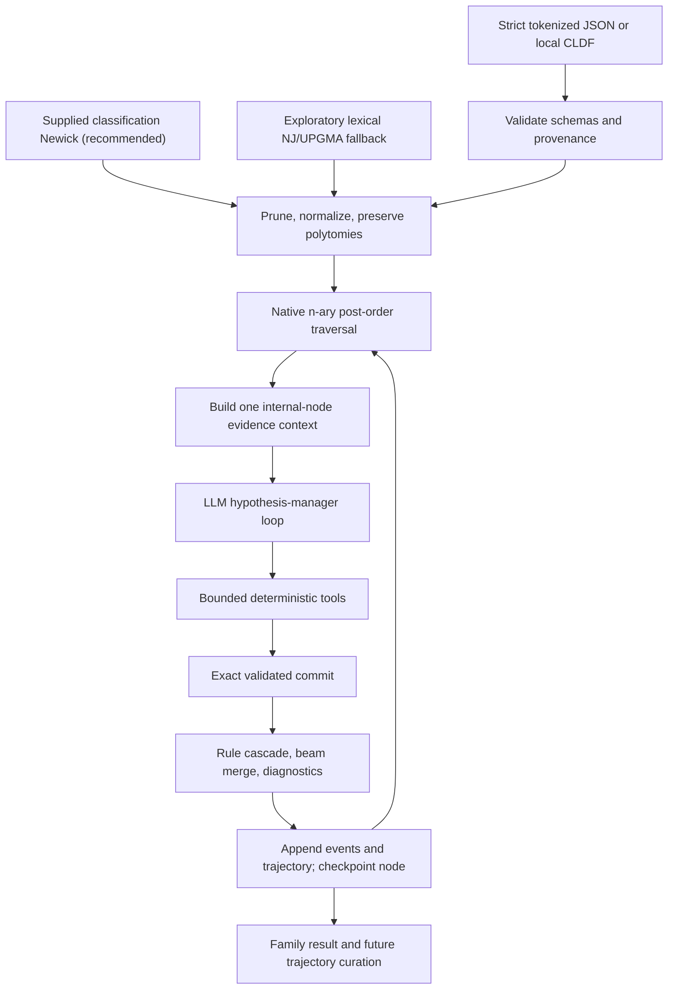

# Cognate Reconstruction Harness

> Current-state guide for developers and coding agents. Last verified:
> 2026-08-15, package version 0.2.0.

`cognate_reconstruction` is the supported product in this repository. It is
an auditable historical-linguistics harness in which an LLM manages
hypotheses, while typed deterministic code owns evidence access, alignment,
sound-law execution, validation, beam construction, tree traversal, recovery,
and artifacts.

The former product direction—generating Stage-1 cognate-reflex and Stage-2
proto/historical reconstruction JSONL from Lexibank—is archived in the
[predecessor repository](https://github.com/acraevschi/llm_cognate_reflexes).
That code and its generated corpora are useful research history, but they are
not the default workflow and are not equivalent to the multi-turn tool
trajectories produced by the harness.

## Project contract

The intended division of responsibility is:

- the human supplies tokenized lexical evidence and, for research use, an
  independently justified classification tree;
- the LLM inspects bounded evidence, proposes child-to-parent sound rules,
  tests them through constrained tools, and commits a hypothesis;
- deterministic code applies the exact validated rule cascade, constructs a
  parent beam, records diagnostics, checkpoints the completed node, and
  continues upward;
- trajectories preserve the model/tool interaction for audit and possible
  future fine-tuning.



A runtime classification tree is fundamental. The archived
`historical_lineages.csv` and temporal-tree code had a different purpose:
they selected targets for old corpus generation. Curated lineage metadata may
now validate explicit target/anchor bindings, but it never creates or replaces
the runtime classification tree.

## Status at a glance

| Area | Current state | Evidence or boundary |
| --- | --- | --- |
| Core package boundary | Implemented | `cognate_reconstruction` has no runtime imports from `cognate_reflexes`; packaging includes only the supported namespace. |
| Strict custom JSON | Implemented | Pydantic v2 models reject extra or malformed fields; forms are token arrays. |
| Local Lexibank/CLDF | Implemented and smoke-tested | Dataset-scoped IDs, conservative segmentation, cognacy memberships, partial slices, and provenance are retained. |
| Supplied Newick | Implemented and recommended | Quoting, leaf validation, pruning, unary collapse, branch lengths, internal IDs, and unresolved polytomies are supported. |
| Tree induction | Implemented, exploratory | LingPy LexStat SCA distances with neighbor joining or UPGMA; not an independent classification. |
| Historical targets and anchors | Implemented | Strict external anchors and explicit CLDF historical bindings support hidden `target` and visible `anchor` roles. |
| LLM tool loop | Implemented | Nine typed tools, bounded turns/calls, same-session rule validation, ordered cascade preview, exact commit checks, coded rejections with remediation, read-only prior-node hypotheses, and windowed stall/truncation handling. |
| Deterministic reconstruction | Implemented | Literal token-rule cascades, n-ary beam combination, derivation provenance, diagnostics, and optional scored anchors. |
| Provider abstraction | Partially production-ready | LiteLLM request/response contract is unit-tested; LM Studio discovery and small live tool runs have worked. Model/provider reliability is not guaranteed generically. |
| Observability and recovery | Implemented with limits | Console and JSONL events, failed trajectories, transient retries, run limits, and completed-node checkpoints. No mid-node resume. |
| Trajectory curation | Implemented at a mechanical level | Version 2.0 validation, summaries, workflow-quality filtering, and generic tool-training export. No expert linguistic grader or deterministic replay command. |
| Research-grade evaluation | Partial | Exact held-out historical target evaluation exists; broad curated family benchmarks and a validated quality objective do not. |
| Training backend | Not implemented | Trajectory export is the boundary for later work; no TRL/Unsloth training pipeline is included. |
| Human-facing trace/result viewer | Not implemented | Live console output and JSON/JSONL can be inspected with `jq`; there is no dedicated report UI or trace browser. |

The harness is ready for controlled local experiments and deterministic
development. It is not yet a system whose mechanically accepted
reconstructions should be treated as historically correct without expert
review.

## Repository map

```text
cognate_reconstruction/
├── schemas/            strict serialized contracts
├── ingestion/          custom payload, CLDF, compatibility, tree preparation
├── tree/               self-contained Newick model and n-ary post-order walk
├── alignment/          typed LingPy SCA alignment wrapper
├── rules/              literal sound-law parser and token engine
├── traversal/          beams, deterministic reconstruction, checkpoints
└── agent/
    ├── providers/      provider protocol and LiteLLM adapter
    ├── tools/          deterministic model-facing tools
    ├── SKILL.md        hypothesis-manager instructions
    ├── error_codes.py  closed rejection vocabulary and its classification
    ├── orchestrator.py bounded/retrying model loop
    ├── events.py       console and JSONL events
    └── trajectory.py   versioned audit/training artifacts

tests/workbench/        supported product tests
examples/               strict JSON, anchor, tree, and minimal CLDF fixtures
docs/running_inference.md
MIGRATION.md
```

Start with:

- [the full inference/CLI guide](docs/running_inference.md) for schemas,
  commands, provider options, and artifact contracts;
- [the migration note](MIGRATION.md) for what moved and why;
- [the agent instructions](cognate_reconstruction/agent/SKILL.md) for the exact
  comparative-method and tool-use policy; and
- [the archive boundary](#archive-boundary) before reviving any archived corpus
  code from the predecessor repository.

## Installation and development environment

Python 3.11 or newer is required. Repository validation uses the
`llm_reconstruction` Conda environment.

```bash
conda env update -f environment.yml --prune
make install
make test
```

`environment.yml` installs the editable core package, but not the optional
LiteLLM dependency. Run `make install` (equivalent to installing
`-e '.[agent]'`) before real inference. Core deterministic tests can run
without a live provider.

Useful Make targets:

```bash
make help
make test
make smoke-lexibank
make smoke-iecor-historical
make cli-help
```

`make smoke-iecor-historical` additionally requires the user-managed,
git-ignored checkout at `data/lexibank/iecor`; it is not a fresh-clone smoke
test.

## Quick start

### 1. Reproduce local CLDF preparation

The checked-in fixture needs no download:

```bash
make smoke-lexibank
```

This lists exact dataset-scoped variety IDs and writes a validated workbench
payload to `/tmp/cognate-reconstruction-fixture.json`.

### 2. Run strict custom JSON through a generic LiteLLM provider

A small example is checked in at
[`examples/reconstruction_input.json`](examples/reconstruction_input.json).

```bash
export MY_PROVIDER_API_KEY='...'

conda run --no-capture-output -n llm_reconstruction +  cognate-reconstruct infer +  --input examples/reconstruction_input.json +  --model '<litellm-model-identifier>' +  --api-key-env MY_PROVIDER_API_KEY +  --output runs/example/result.json +  --trajectories runs/example/trajectories.jsonl +  --events runs/example/events.jsonl +  --checkpoint runs/example/checkpoint.json
```

Use a fresh trajectory/checkpoint path for a new experiment. Trajectories and
events are append-only, while an existing checkpoint requires `--resume`.

### 3. Run a loaded LM Studio model

LM Studio is a preset, not the conceptual default provider:

```bash
conda run --no-capture-output -n llm_reconstruction +  cognate-reconstruct lm-studio-models

LM_RUN_DIR="runs/lm-studio-$(date +%Y%m%d-%H%M%S)"
mkdir -p "$LM_RUN_DIR"

conda run --no-capture-output -n llm_reconstruction +  cognate-reconstruct infer +  --preset lm-studio +  --model '<loaded-tool-capable-model-id>' +  --input examples/lm_studio_smoke_input.json +  --output "$LM_RUN_DIR/result.json" +  --trajectories "$LM_RUN_DIR/trajectories.jsonl" +  --events "$LM_RUN_DIR/events.jsonl" +  --checkpoint "$LM_RUN_DIR/checkpoint.json" +  --temperature 0 +  --max-turns 16 +  --max-tool-calls 32
```

The CLI is verbose unless `--quiet` is supplied. With `conda run`, keep
`--no-capture-output` so events stream immediately.

Provider options such as `max_tokens` are model-specific. In particular,
[`examples/lm_studio_qwen_config.json`](examples/lm_studio_qwen_config.json)
is a deliberately bounded 1,024-token example. Reasoning models may spend that
entire allowance before emitting a tool call. Do not reuse it when unrestricted
reasoning/output is intended.

## Input contracts

### Strict workbench JSON

`infer` accepts a `WorkbenchPayload` containing:

- at least two `LanguageLexicon` objects;
- immutable `LexicalForm` records with exact `variety_id`, `concept_id`,
  and non-empty tokenized `segments`;
- optional concept metadata;
- a supplied `newick`, or an explicitly exploratory `tree_method`; and
- optional embedded historical target/anchor bindings.

Rules and alignments operate on tokens, not Unicode characters. `+` and `-`
are structural morphological boundaries. Raw orthography is never
automatically split into segments.

### Local Lexibank/CLDF

The supported adapter reads existing CLDF. It does not clone a repository or
run `lexibank makecldf`.

```bash
cognate-reconstruct list-lexibank-varieties +  --dataset examples/lexibank_fixture

cognate-reconstruct prepare-lexibank +  --dataset examples/lexibank_fixture +  --newick-file examples/lexibank_fixture/tree.nwk +  --concept-id 948 +  --concept-id 221 +  --output runs/fixture-input.json
```

Important ingestion guarantees:

- variety, fallback concept, and cognate-set IDs are dataset scoped;
- source Glottocode and tree Glottocode remain separate;
- segmentation uses CLDF `Segments`, then `Phonemic_Segments`, and skips
  rows that have neither;
- all CognateTable membership rows are retained;
- standard `Segment_Slice` values are validated and normalized to zero-based
  token positions while preserving the original notation and source row;
- multiple whole-form memberships remain explicit alternative analyses; no
  unrecorded primary choice or weight is invented;
- custom morpheme-indexed partial-cognacy conventions currently recognized for
  `liusinitic` and `tuled` are tagged as compatibility rules;
- `tlopo` and `tuled` tree-Glottocode repairs are narrow and auditable; the
  legacy heuristic `sidwellvietic` cognate relinking is not applied.

Repeat `--variety-id` and `--concept-id` to bound an experiment. Unknown
IDs and selections that leave a variety without tokenized cognate evidence are
rejected.

### Classification trees

A supplied classification Newick is the recommended research path.

- leaf labels must be exact dataset-scoped variety IDs;
- missing selected varieties are errors;
- extra branches without selected lexical evidence are pruned;
- unary nodes created by pruning are collapsed;
- quoted labels and unresolved polytomies are preserved;
- named internal nodes are strongly recommended when anchors, historical
  targets, checkpoints, or stable result IDs matter;
- unnamed internal nodes receive deterministic path IDs such as
  `internal:root.0`.

When no Newick is supplied, the harness can induce a lexical NJ or UPGMA tree
using LingPy LexStat SCA distances. This is an exploratory convenience. It
must not be reported as equivalent to an independently justified
classification.

### Historical forms: hidden targets versus visible anchors

Historical forms can be removed from observed leaf evidence and explicitly
bound to a named internal node:

- `target`: hidden from the model and evaluated after deterministic
  reconstruction with exact top-candidate and beam-level token matches;
- `anchor`: included in the prompt/tools/trajectory and handled according to
  `ignore`, `advisory`, or `scored`.

Use either:

- [a strict JSON binding file](examples/historical_bindings.json);
- the curated `data/historical_lineages.csv` plus an explicit role; or
- [an external anchor file](examples/anchors.json) passed to `infer`.

Node IDs, concepts, form ownership, tokenization, and provenance are validated.
The lineage CSV only checks ancestry/branch declarations against a separately
supplied tree; it never determines live traversal order.

Anchor policies are:

- `ignore`: retain anchor provenance in prompt/trajectory, but exclude it
  from deterministic rule reports and scoring;
- `advisory`: report exact matches/mismatches without changing scores;
- `scored`: add the explicit `log(anchor_match_factor)` boost for a unique
  exact match.

## The LLM hypothesis-manager loop

The model receives compact active-child summaries and explicit anchors, then
retrieves evidence incrementally. It cannot execute arbitrary code.

| Tool | Purpose and deterministic boundary |
| --- | --- |
| `list_concepts` | Paginate concept IDs, glosses, counts, and available nodes. |
| `search_forms` | Filter exact forms by semantics, tokens, cognacy, node, relation, or position. |
| `list_available_nodes` | Show observed and already reconstructed evidence nodes, including descendants/outgroups and which have a retrievable hypothesis. |
| `get_node_reconstruction` | Return the rules, anomalies, and summary committed at one already-reconstructed node, read-only. |
| `get_alignments` | Produce LingPy n-way SCA alignments and pairwise correspondence summaries for an explicit bounded selection. |
| `segment_morphemes` | Create an immutable boundary-only overlay; phonetic tokens cannot be changed. |
| `test_sound_law` | Parse one literal child-to-parent rule and return exact per-form applications and failures. |
| `test_rule_cascade` | Preview the complete ordered branch-scoped cascade, every intermediate diff, and final forms. |
| `commit_reconstruction` | Accept only exact same-session validated rules, scopes, order, overlay, support, anomalies, and node ID. |

A rejected tool call returns `{error_type, message, code, remediation}`.
`remediation` is deterministic text derived from recorded session state — for a
rejected commit it lists every `(validation_call_id, dsl, source_child_ids)`
triple the session recorded — so a model that has to join two records is shown
the join key instead of a bare Pydantic dump.

`code` is a stable machine identifier for *what was wrong*, drawn from the closed
vocabulary in
[`agent/error_codes.py`](cognate_reconstruction/agent/error_codes.py). Schema
rejections derive theirs structurally from the sorted set of
`(field location, error type)` pairs with list indices collapsed, so
`rules.0.confidence` and `rules.1.confidence` both render as
`schema:rules[].confidence=missing`. The code is used only for counting and
matching — repeated-failure detection, the failure taxonomy, and the
exploratory/protocol split. Humans and the model still read `message`, which is
unchanged and complete; that separation is why collapsing two distinct problems
into one code costs nothing in auditability.

### The commit contract

`commit_reconstruction` requires per rule only the `dsl`, the
`source_child_ids`, and the model's own `confidence`:

- `validation_call_id` may be omitted. The harness then resolves it by looking
  for a successful same-session `test_sound_law` validation whose parsed rule
  source, child scope, and segmentation overlay are all identical to the
  committed rule, and resolves only on a unique match. Zero or multiple matches
  are rejected with the remediation list above; nothing is guessed. **The
  same-session-validation invariant is unchanged** — resolution removes the
  transcription step, not the check. The resolved ID is written into the stored
  request, so the trajectory stays explicit about which validation was used.
- `supporting_form_ids` may be omitted and defaults to the resolved
  validation's forms. Those are deterministic engine output, not a model claim;
  a supplied list must still be a subset of them, and a rule that applied to no
  form is still rejected.
- `rationale` is optional. The required top-level `summary` carries the
  reasoning, and no deterministic check consumes per-rule prose.
- `confidence` stays required: it is a model judgement that the beam consumes as
  a score weight, and defaulting it would invent a claim the model never made.

`get_alignments` requires an explicit selection of at most 12 concept IDs or
48 exact form IDs. This bound is intentional even when the model has a very
large context window: the model should work through small evidence batches,
not load an entire family at once.

### What crosses a node boundary

Every node gets a fresh conversation: the orchestrator rebuilds `messages` from
the instructions plus that node's payload, and `AgentContext` — validations,
overlays, commit — is new. That is deliberate, and it is what makes each
trajectory one independent tool-use example.

Two things cross the boundary, both read-only and both pulled by the model
rather than pushed into the prompt:

- reconstructed lexicons, reachable through `list_available_nodes` and
  `search_forms(scope="available_tree")`, as before; and
- the hypothesis committed at an already-reconstructed node — its rule DSL,
  child scope, confidence, anomalies, and summary — through
  `get_node_reconstruction`, one node per call.

The second exists because the comparative method is iterative: a correspondence
established at one node constrains its neighbours, and without this every
internal node of a 170-concept family re-derives the same correspondences while
nothing makes adjacent, mutually contradictory rule inventories visible. A
prior node's rule is a *hypothesis*, on the same footing as a reconstructed form
not being direct attestation. **It has no effect on scoring.** Whether a
parent's confidence should propagate into a child's beam, or cross-node
inconsistency should be penalised, changes what counts as a valid
reconstruction and is listed under decisions requiring research-owner input.

Visibility is gated on the traverser's reconstructed-evidence set, which
post-order populates only after a node completes, so nothing leaks from a node
that has not been reconstructed yet. Session-local identifiers — validation call
IDs, supporting form IDs, overlay IDs — are excluded, because they mean nothing
in another session.

One limitation: these hypotheses live in the reconstructor for the duration of
one process. Nodes restored from a checkpoint under `--resume` were never run in
that process, so their committed rules are not retrievable after a resume even
though their reconstructed lexicons are.

A normal successful node session is:

1. list/search evidence;
2. align a bounded representative batch;
3. propose and test every rule;
4. refine weak rules after reading applications, absent targets, context
   mismatches, and anchor mismatches;
5. preview the complete order when multiple rules interact;
6. commit the exact tested hypothesis and explicit anomalies;
7. let deterministic code reconstruct the parent.

## Sound-rule DSL

Rules are operational child-to-parent transformations and are applied exactly
as written:

```text
f > p / #_
k > tʃ / _i
n > m / _p
p > Ø / _#
```

Current semantics:

- targets, replacements, and contexts are literal token sequences;
- multi-token expressions are space-separated;
- `#` is a word edge and `_` marks the target position;
- `+` and `-` may constrain context but cannot be targets or insertions;
- `Ø` or `∅` is deletion;
- rules are an ordered cascade;
- every rule has an explicit active-child scope and model-supplied confidence;
- a rule whose target and replacement are identical is rejected;
- identity reconstruction is represented by `rules: []`.

The engine does not infer inverse historical rules. A non-bijective sound
change cannot be inverted deterministically, so the model must formulate the
required child-to-parent mapping explicitly.

Not implemented in the DSL: feature bundles, phonological classes, wildcards,
regular expressions, optional segments, backreferences, empty-target
insertion, non-local environments, or automatic rule inversion.

## Deterministic beam and diagnostics

For each concept:

1. observed leaf variants begin as an equal-mass distribution;
2. branch-scoped rules transform retained child candidates in order;
3. child log scores and the confidence of rules that actually applied are
   combined;
4. disagreeing child outputs receive a transparent branch penalty;
5. exact scored-anchor matches optionally add the configured boost;
6. identical outputs are merged with log-sum-exp, normalized, and pruned to
   `beam_width`.

Every candidate retains derivation and child-candidate provenance. The output
probabilities are normalized heuristic beam mass, not calibrated Bayesian
posteriors. Model confidence, the disagreement penalty, and optional anchor
boost are operational scoring choices rather than a validated linguistic
theory.

Each completed node reports:

- committed rule count and structural rule-complexity cost;
- evaluated rule results and successful applications;
- target-absent, context-mismatch, and anchor-mismatch counts;
- mechanical rule coverage over applicable results;
- anomaly count/rate; and
- whether the result was an empty identity reconstruction.

Rule complexity is diagnostic only. It does not currently change the default
beam score.

`rule_coverage` is `successful_applications / applicable_rule_results`, where
`applicable_rule_results` excludes evaluated results whose form never contained
the rule's target. An in-scope child that simply never shows the target is
vacuous for that rule, not a counterexample to it, and the old
`successful_applications / rule_results_evaluated` figure therefore measured
scoping convention rather than the rule: `f > p / #_` scoped to three children
scored 0.33 while the identical reconstruction scoped to the one child showing
`f` scored 1.0. Both now score 1.0. `target_absent`, `rule_results_evaluated`,
and `applicable_rule_results` remain visible as raw counts, so a scope wider
than the evidence is still legible — it is just no longer laundered through the
coverage number.

The metric was fixed rather than the instruction. Telling the model in
`agent/SKILL.md` to scope rules only to children that exhibit the target would
depend on the model complying, and would also press it to narrow a *linguistic*
claim about which branches a correspondence holds for in order to satisfy a
*mechanical* counter. That coupling is the defect, not the scope.

## Outputs, recovery, and trajectory curation

A normal run writes four artifacts:

| Artifact | Meaning |
| --- | --- |
| `result.json` | Full traversal snapshot, internal beams/best lexicons, diagnostics, and optional historical-target evaluation. |
| `trajectories.jsonl` | Append-only versioned model/tool/commit/deterministic records, one record per attempted node. |
| `events.jsonl` | Append-only chronological operational events for console/application monitoring. |
| `checkpoint.json` | Atomic completed-node deterministic state for resume. |

Provider failures, run-budget failures, and loop-limit failures write an
incomplete trajectory before propagating the exception. Completed prior nodes
remain checkpointed.

Resume requires the same main input, normalized tree, and non-secret CLI
configuration:

```bash
cognate-reconstruct infer +  ... +  --checkpoint runs/family/checkpoint.json +  --resume
```

The next unfinished node starts a new model session. There is no partial
message/tool-loop checkpoint.

Trajectory commands:

```bash
cognate-reconstruct validate-trajectories +  --input runs/family/trajectories.jsonl

cognate-reconstruct summarize-trajectories +  --input runs/family/trajectories.jsonl

cognate-reconstruct export-trajectories +  --input runs/family/trajectories.jsonl +  --output runs/family/high-quality-examples.jsonl +  --high-quality-only +  --max-anomaly-rate 0.1
```

The current `high_quality` flag is a conservative workflow filter. It requires
a completed deterministic step, evidence inspection, same-session validation
for committed rules, a cascade preview for multi-rule commits, no no-op rules,
and a *protocol*-failure rate at or below `MAX_PROTOCOL_FAILURE_RATE`. It does
not grade linguistic truth. An inspected empty identity commit can pass without
a sound-law test, although `identity_without_testing` remains visible.

**Not every rejected call counts against the flag.** Each rejection is
classified by its error code as `exploratory` or `protocol`:

- **exploratory** — `dsl-parse-error`, `no-op-rule`, and `empty-scope`. The
  model proposed a sound law, the deterministic parser refused it, and the model
  refined. That is the hypothesis loop working, and charging for it would score
  a model that explores below one that never explores — backwards for a corpus
  meant to teach tool use.
- **protocol** — everything else: commit reference errors, unknown tools, and
  every `schema:*` argument-shape rejection. This is friction with no epistemic
  content.

Anything unclassified is protocol; the split fails closed, and a test asserts
that every code in the vocabulary is classified explicitly.

`AgentNodeMetrics` records `failed_tool_call_count` (the total),
`protocol_failure_count`, `tool_failures_by_type`, and
`truncated_response_count`; `protocol_failure_rate` is
`protocol_failure_count / tool_call_count`. `tool_failures_by_type` keys on the
structural error code, so a real run now reports
`{"schema:rules[].confidence=missing": 4}` rather than `{"ValidationError": 4}`.
The field name is unchanged deliberately: records written days ago already carry
it, and `extra="forbid"` would make a rename unloadable — a purely cosmetic gain
against a real loss of append-only auditability.

**The threshold is 0.25, and it is a workflow heuristic rather than a linguistic
judgement.** A session may misstep once and recover; a session that spends most
of its budget being rejected by the tool schemas is a poor tool-use example
whatever its linguistics, and exporting it for later fine-tuning would teach the
wrong protocol. A rate is used rather than an absolute count so the gate does not
tighten as sessions get longer — and a floor of one protocol failure keeps it
from tightening as they get *shorter*, since a three-call identity commit
otherwise hits 0.33 on a single slip. A session passes when it has at most one
protocol failure **or** a protocol rate at or below the threshold.

These fields are additive and defaulted, so trajectories written before they
existed still load and keep the verdict they already had. `protocol_failure_count`
defaults to `None` rather than `0`, and that distinction is load-bearing: an
older record has a real `failed_tool_call_count` and no protocol count, so
reading the absent counter as zero would hand it "zero protocol failures" and let
a trajectory that legitimately failed the gate start passing it. With `None` the
rate falls back to `failed_tool_call_count / tool_call_count` and the record
keeps its original verdict, which the suite checks against every
`runs/*/trajectories.jsonl` present locally.

`schema_version` stays `2.0`. The new fields are additive with defaults, so
every 2.0 file — old and new — validates against the same literal, and each
record already carries a `trajectory_schema_sha256` that changes precisely when
the schema does. Bumping the literal would fork the readable-version set
without adding information that hash does not already give.

`validate-trajectories` means that each JSONL record satisfies the versioned
schema and outcome invariants. It does not re-execute every recorded tool call
or independently reproduce the deterministic step.

### Inspect artifacts today

There is no dedicated trace viewer yet. Useful `jq` views are:

```bash
RUN_DIR="runs/family"

# Compact operational timeline
jq -r '[.timestamp, .kind, .message] | @tsv' +  "$RUN_DIR/events.jsonl" | less -S

# Committed rule DSL, scope, and confidence
jq -r '
  .committed_reconstruction.request.rules[]? |
  [.rule_id, .dsl, (.source_child_ids | join(",")), (.confidence | tostring)] |
  @tsv
' "$RUN_DIR/trajectories.jsonl"

# Node diagnostics and model-loop metrics
jq '{
  node_id,
  completed,
  failure,
  metrics,
  diagnostics: .reconstruction_step.diagnostics
}' "$RUN_DIR/trajectories.jsonl"

# Best reconstructed forms
jq -r '
  .internal_nodes[] |
  .node_id as $node |
  .best_lexicon.forms[] |
  [$node, .concept_id, (.segments | join(" "))] |
  @tsv
' "$RUN_DIR/result.json"
```

## Verification snapshot

The following was re-run in `llm_reconstruction` on 2026-08-15:

| Check | Result |
| --- | --- |
| Supported suite: `pytest -q` | 141 passed (127 fixed tests, plus one per `runs/*/trajectories.jsonl` present locally; `pytest -q -k "not local_run_artifacts"` reports the fixed 127) |
| `make smoke-lexibank` | 2 varieties, 4 tokenized forms, 2 concepts; supplied tree normalized successfully |
| `make smoke-iecor-historical` | 6 evidence varieties, 1,029 tokenized forms, 170 concepts, 1 hidden historical binding; supplied tree normalized successfully |
| CLI installation/help | `cognate-reconstruct` available; all seven CLI subcommands load |
| Core/agent versions in the environment | harness 0.2.0, LiteLLM 1.81.16, Pydantic 2.13.4, LingPy 2.6.14 |
| LM Studio discovery | Local `/v1/models` discovery succeeded |
| Archived-code import audit | No runtime import of `cognate_reflexes`; the package has no dependency on archived corpus code |

The supported suite includes a scripted end-to-end provider that performs
evidence inspection, alignment, sound-law testing, cascade preview, commit,
deterministic reconstruction, trajectory writing, and high-quality export. It
also covers anchors, historical targets, cognate membership/slice handling,
Newick normalization/polytomies, provider request normalization, retries,
failed trajectories, checkpoints, and resume. It additionally covers
validation-call resolution (unique, absent, and ambiguous), commit remediation
text, protocol-failure metrics and the `high_quality` gate, orchestrator stall
and truncation handling, coverage scoping, and backward compatibility against
both a checked-in pre-change fixture and every `runs/*/trajectories.jsonl`
present locally.

It also covers the structural error codes specifically: that index-normalized
schema codes are deterministic and identical for one mistake repeated at
different list positions, that a scripted provider varying only the *text* of
its rejections now ends in `ProtocolStallError`, that the trailing stall window
forgives widely-spaced repeats but not the same spacing inside one window, that
every code raised anywhere in `agent/` is in the classified vocabulary (read out
of the source by an AST scan, so a new raise site cannot widen it silently), and
that two sessions with the same rejected-call count get opposite `high_quality`
verdicts when one's failures are exploratory and the other's are protocol. It
covers window saturation with a provider that never repeats a code — nine
differently-shaped rejections in rotation — and confirms that the exploratory
one among them occupies a window slot without counting toward the trip. Two
repository-hygiene checks guard the triage driver: its hand-copied exploratory
set must equal the real classification, and the two checked-in copies of the
skill must stay byte-identical.

Local ignored live-run artifacts also demonstrate both success and failure:

- `runs/google-gemma-4-e4b-20260815-101423`: the pre-change commit-protocol
  baseline — seven turns, seven tool calls, three of them (43%) rejected
  `commit_reconstruction` schema errors, `coverage 0.33` on a correct
  reconstruction, and `high_quality: 1` despite the failures;
- `runs/google-gemma-4-e4b-20260815-102805` and
  `runs/google-gemma-4-e4b-20260815-103955`: the same input and model after
  this work — four turns, four tool calls, zero rejected, and the identical
  reconstruction in ~45s instead of 99s. The second committed the baseline's
  own broad-scope `f > p / #_` across all three children and scored
  `coverage 1.00` with `target_absent 4` still reported, against the
  baseline's 0.33 for the same rule;
- `runs/google-gemma-4-e4b-20260815-104140`, a two-internal-node run of the same
  lexicons under `(language_a,(language_b,language_c)INNER)PROTO;`: `INNER`
  committed an identity reconstruction and `PROTO` then committed `f > p / #_`
  scoped to `INNER`, giving the correct `p a` / `p u r`. `PROTO` also rejected
  four commits (31%), so the run reports `high_quality: 1/2` — the live form of
  the gate. Those four rejections alternated between two error signatures, which
  is what motivated counting repeats per signature rather than only
  consecutively. Its rejections predate error codes, so triage reports them
  under a `legacy:` prefix derived from the message, which is exactly the
  unstable signature the codes replaced;
- `runs/google-gemma-4-26b-a4b-20260815-185157` and
  `runs/google-gemma-4-e4b-20260815-185318`, after the error-code work: the
  three-language input in 32s over five clean tool calls, and the two-node tree
  in 86s over eight clean tool calls across both nodes, `high_quality: 2/2`.
  Both record `protocol=0`;
- `runs/google-gemma-4-26b-a4b-20260815-210535`, the first live artifact to
  exercise a structural code: the three-language input in 24s over six tool
  calls, the correct `p a` / `p u r`, and one rejected `test_rule_cascade`
  reported as
  `schema:rules=too_short,rules[].validation_call_id=extra_forbidden`. The code
  is legible enough to name the model's actual confusion — it put a per-rule
  `validation_call_id` into a cascade spec, which `CascadeRuleSpec` forbids —
  where the previous taxonomy would have recorded only `ValidationError: 1`.
  One protocol failure in six calls is 0.17, so `high_quality` stays 1/1;
- `runs/google-gemma-4-26b-a4b-20260815-220437`, the same model, input, and
  temperature after `CascadeRuleSpec` gained a docstring saying a cascade rule
  carries no validation ID: five tool calls, none rejected, 20s. The rejected
  cascade call from the run above did not recur. That is suggestive rather than
  conclusive — one trial, and a local server is not bit-deterministic at
  temperature 0 — but the tool schema is the only input that changed;
- `runs/gemma-noop-fix.IKD1kR`: one completed `google/gemma-4-e4b`
  trajectory, five turns, five tool calls, one real rule, and
  `high_quality: 1`;
- `runs/qwen35-tujia-20260810-094347`: a structurally valid failed
  `qwen3.6-35b-a3b` trajectory ending in `AgentLoopLimitError` after
  response truncation prevented reliable tool use; the same run would now end
  in `ProtocolStallError` with an explicit truncation event;
- `runs/qwen36-tujia-20260810-102624`: a completed pre-fix trajectory whose
  12 identity-like no-op rules remain audit-readable but now produce
  `high_quality: 0`.

These `runs/` paths are ignored local evidence and may not exist in another
clone. They are listed to make the current verification history explicit, not
as permanent fixtures.

## What is good enough now

The following components are in a usable state for continued research and
engineering:

- the supported package is self-contained and the old generator no longer
  leaks into runtime imports or packaging;
- strict custom and local CLDF inputs fail loudly instead of guessing;
- supplied-tree validation and native n-ary bottom-up traversal are tested;
- the deterministic tool boundary prevents arbitrary code execution and
  unvalidated non-empty commits;
- exact rule and cascade diffs make mechanical behavior reproducible;
- failed and completed node sessions are auditable;
- long family runs can resume from completed node boundaries;
- the fixture and IE-CoR smoke paths are reproducible;
- trajectories are rich enough to be curated for a later tool-use training
  project without pretending that legacy triplet JSONL is equivalent.

## Known problems and rough edges

These are confirmed behavior or missing safeguards, not merely speculative
future ideas.

### Provider and model behavior

- The generic adapter proves LiteLLM's OpenAI-shaped chat/tool contract, not
  reliable behavior from every LiteLLM provider or every model. A model may
  ignore tools, emit malformed arguments, reason indefinitely, or make weak
  linguistic decisions.
- `finish_reason="length"` is now handled explicitly: it emits a
  `response_truncated` event and, when the response carried no tool call, a
  specific instruction to reply with a smaller call. After
  `max_truncated_responses` such responses the node ends in
  `ProtocolStallError`. What is still missing is any automatic recovery — the
  harness names the condition rather than shrinking the request or continuing
  the truncated output.
- A tool rejection reproduced `max_repeated_tool_failures` times **within the
  trailing window of `stall_window_calls` tool calls** now triggers one targeted
  correction carrying the tool's remediation, and one further recurrence raises
  `ProtocolStallError`. The signature is `(tool name, structural error code)`,
  so a model that varies its malformed arguments no longer escapes by changing
  the message text. Occurrences are counted across the window rather than only
  in consecutive runs, because a live gemma session alternated between two
  commit errors so that neither was ever consecutive; the window bounds that
  memory so a long, mostly-productive session is not killed by three
  well-separated repeats of one mistake it recovered from each time. Successes
  occupy window slots, which is what makes distance forgivable without making
  density forgivable — resetting on success instead would be fooled by the
  obvious interleave of a bad commit, a good test, and another bad commit.
- A model that never repeats one code is caught by a second condition on the
  same window: when `max_window_protocol_failures` of the last
  `stall_window_calls` calls were *protocol* rejections — whatever their
  codes — the harness injects one correction naming them and then raises
  `ProtocolStallError`. Exploratory rejections are excluded, so a model working
  through malformed sound laws is never stopped for it however many it gets
  wrong. What remains unhandled: two genuinely different mistakes that happen to
  share a code are counted as one. Triage makes that visible by reporting the
  number of distinct messages behind each code, which is the evidence for
  splitting a code rather than a fault in itself.
- With the currently observed LiteLLM/Pydantic combination, live LM Studio
  calls may print nonfatal `PydanticSerializationUnexpectedValue` warnings.
  Tool execution and normalized trajectories can still succeed, but the noise
  has not been narrowly suppressed or eliminated with a verified dependency
  pin.
- Provider retries cover normalized transient transport/status failures. They
  do not retry a technically successful but linguistically unhelpful response.

### Resume and budget integrity

- The checkpoint compatibility hash covers the main input text, normalized
  tree, and public CLI/provider options. It does not currently include the
  contents of a separate `--anchors` file, the loaded agent instruction text,
  or tool-schema hashes. Changing those while using `--resume` is not detected
  by the CLI checkpoint check.
- Total turn, tool-call, wall-time, and reported-cost counters are recreated
  when a process resumes. Current “total run” limits therefore bound one CLI
  invocation, not the cumulative history of a run across resumptions.
- Checkpoints are node-boundary snapshots only. Work inside the failed active
  node is retained in its trajectory but replayed from a fresh model session.
- Cost limits work only when the provider reports cost metadata.

### Quality and scoring

- Mechanical validation proves exact parsing, scope, ordering, and
  reproducibility. It does not prove cognacy, direction of change,
  chronological plausibility, regularity, or historical correctness.
- `high_quality` is a workflow heuristic, not an expert label. It does not
  score held-out accuracy, correspondence recurrence, support diversity, or
  linguistic plausibility. Its protocol-failure threshold (0.25) and its
  single-failure floor are engineering judgements chosen from a handful of local
  runs, not calibrated values. The exploratory/protocol split now decides *what*
  is counted against that threshold, and that boundary is itself a judgement:
  `empty-scope` is treated as the model probing its evidence, but a model that
  never learns which children hold a target would be scored as exploring rather
  than as failing.
- Beam probabilities are normalized heuristic scores and should not be
  interpreted as calibrated uncertainty.
- Rule confidence is supplied by the model. There is no independent
  calibration or learned likelihood model.
- Rule complexity is visible but does not penalize the beam. No agreed
  parsimony objective combines description length, exceptions, residual
  mismatch, and coverage.
- An empty identity commit is valid. Inspection is required for the
  `high_quality` filter, but a hypothesis test is not.
- Historical target comparison uses exact token equality. There are no graded
  phonological, edit-distance, or expert-judgment metrics.

### Data and user experience

- There is no general CSV importer, guided family selector, or
  Glottolog-to-dataset mapping workflow. Supported entry points are strict JSON
  and existing local CLDF.
- The harness deliberately does not download/build large Lexibank datasets.
- There is no dedicated input validation report, result dashboard, trace
  browser, or side-by-side rule/cascade report. Inspection is currently
  console plus JSON/JSONL tooling.
- Historical benchmark curation beyond the checked-in lineage metadata is not
  automated.
- Partial and alternative cognacy are preserved faithfully, but the exploratory
  tree-induction fallback uses only unambiguous whole-form cognate IDs. A
  weighted policy would require an explicit research decision.

### DSL and reconstruction model

- The literal DSL cannot express many common abstractions, including feature
  classes, disjunction, optionality, epenthesis, metathesis, long-distance
  conditioning, or morphology beyond explicit adjacent boundaries.
- The backend does not automatically infer or invert rules.
- The current beam combines branch evidence with transparent operational
  heuristics; it is not a full probabilistic sound-change model.
- No automatic linguistic review gate prevents a mechanically valid but
  implausible rule inventory from becoming a completed trajectory.
- Adjacent nodes can now *read* each other's committed hypotheses, but nothing
  detects or reports mutually contradictory rule inventories across a family.
  Consistency remains something a human reads out of the trajectories.

### Trajectory and training boundary

- Trajectory validation is schema validation, not deterministic replay.
- Exported examples are generic multi-turn tool supervision. There is no
  tokenizer/template adapter, dataset split policy, trainer, evaluator, or
  model release pipeline.
- Append-only historical records remain readable even when newer quality rules
  would reject their commits. This is intentional for audit, so
  `valid: true` must not be confused with `high_quality: true`.

## Prioritized next work

### Reliability first

1. Include external anchors, instruction hashes, and tool-schema hashes in
   checkpoint compatibility; decide whether resumed budgets should be
   cumulative. This became more pressing, not less. `agent/SKILL.md` and the
   tool schemas both changed in this work, and `infer` builds its own
   configuration hash in `_provider_and_configuration` that covers none of
   them — nor the `max_repeated_tool_failures` / `stall_window_calls` /
   `max_truncated_responses` / `max_window_protocol_failures` thresholds, none
   of which has a CLI flag. A checkpoint written before this release still
   resumes cleanly even though the model now receives different instructions and
   a different tool schema. Do this as **one** change rather than adding the
   missing inputs to the hash piecemeal: every addition invalidates every
   existing checkpoint, so paying that cost repeatedly buys a fraction of the
   safety each time. Exposing the stall thresholds as CLI flags belongs in the
   same change, since a flag nobody hashes is a flag that silently changes a
   resumed run.
2. Recover from truncation rather than only naming it — the harness now
   detects `finish_reason="length"` and stalls deliberately, but it cannot
   shrink a request or continue a cut-off response.
3. Decide whether an exploratory rejection should ever end a node. Neither stall
   condition counts one today: repeats are caught per structural code, window
   saturation counts only protocol rejections, and a model that tests malformed
   sound laws indefinitely is bounded by the turn limit alone. That is the
   deliberate choice — exploration is what the trajectories are meant to teach —
   but it has not been checked against a session that exploits it.
4. Remove or narrowly suppress the known LiteLLM/Pydantic serializer warning
   only after confirming response fields remain intact.
5. Add one maintained live-provider contract test for each provider/model
   combination the project is willing to claim as supported.
6. Add a readable `inspect-run`/HTML report and a deterministic trajectory
   replay validator.

### Research validity next

1. Define an expert-review and benchmark protocol for completed trajectories.
2. Curate held-out historical nodes/families with explicit provenance and
   leakage controls.
3. Calibrate the `high_quality` protocol-failure threshold against a real
   corpus of trajectories instead of the current judgement call. The second half
   of this item is now decided in code — an exploratory rejection does *not*
   count the same as a commit-schema one — but 0.25 and the single-failure floor
   are still engineering judgements, and the exploratory/protocol boundary itself
   deserves the same corpus check. The cheap enabling step, which needs no
   research decision, is to report the *distribution* of per-trajectory protocol
   rates from `summarize-trajectories` rather than only the pooled rate and a
   count above threshold; a threshold cannot be calibrated against a number that
   has already been averaged.
4. Decide whether parsimony should affect scoring, and document the objective
   before implementing it.
5. Add diagnostics for recurring correspondence support, residual mismatch,
   support across concepts/branches, and calibrated uncertainty.
6. Decide which DSL extensions are scientifically necessary without turning
   model input into arbitrary executable patterns.

### Product ergonomics later

1. Add a guided input-validation/preparation report and, if genuinely needed,
   a generic CSV adapter.
2. Build a human-facing trace/result explorer.
3. Define an explicit trainer/evaluator adapter over curated trajectory 2.0
   examples; do not revive legacy Stage-1/Stage-2 JSONL as a silent substitute.

## Decisions that require research-owner input

- What exact objective, if any, should trade rule complexity, exceptions,
  residual mismatch, and regular coverage?
- What evidence is sufficient for an identity reconstruction to be considered
  training-quality?
- Which provider/model combinations should be maintained as supported rather
  than merely compatible through LiteLLM?
- Which historical families/nodes should form the first benchmark, and what
  leakage boundary should be enforced?
- Should partial/alternative cognacy ever receive weights in exploratory tree
  induction or scoring, and if so, on what linguistic basis?
- Should a hypothesis committed at one node ever affect a neighbouring node's
  score — a parent's confidence propagating into a child's beam, or a penalty
  for cross-node inconsistency? Prior hypotheses are currently readable through
  `get_node_reconstruction` and have no scoring effect whatsoever.
- Which DSL extensions are essential for the intended families?

## Archive boundary

This repository contains the reconstruction harness only. The Stage-1/Stage-2
corpus-generation pipeline is not carried forward here; it remains available in
the archived [predecessor repository](https://github.com/acraevschi/llm_cognate_reflexes):

- the old `cognate_reflexes` package;
- Stage-1/Stage-2 example generation and formatting;
- family split logic and split manifest;
- bulk download/generation/inspection scripts;
- historical-target discovery and temporal-tree machinery;
- generator-only tests and dataset-exception notes.

The one artifact still needed at runtime, the curated lineage CSV, is carried
forward as `data/historical_lineages.csv`. Stage-1/Stage-2 JSONL corpora are not
part of this repository in any form; see [data/README.md](data/README.md) for
what `data/` does and does not contain.

Do not reintroduce archived modules into root defaults or public APIs simply
because they contain useful old code. Migrate a narrow dependency into
`cognate_reconstruction` with focused tests if the live harness genuinely
needs it. Keep the distinction:

```text
runtime:  lexicons + supplied classification tree
          → normalized post-order reconstruction

archived: Lexibank + lineage/temporal discovery
          → generated Stage-1/Stage-2 training examples
```

## Development invariants

Future changes should preserve these rules:

- trace the actual loader, normalized tree, and post-order runtime path;
- keep `cognate_reconstruction` independent of archived corpus code;
- never split raw orthography when CLDF token columns are absent;
- preserve dataset-scoped identity and separate source/tree Glottocode
  provenance;
- preserve every cognacy judgement without inventing hidden weights;
- prefer supplied classifications and label lexical induction exploratory;
- retain native polytomies unless a research decision explicitly resolves
  them;
- keep tool schemas strict and never expose arbitrary code execution;
- require exact same-session validation for every non-empty committed rule;
- test complete ordered cascades, not only individual rules;
- distinguish mechanical correctness, workflow quality, and linguistic truth;
- use `conda run -n llm_reconstruction` for repository verification;
- update this status snapshot when behavior, test counts, or known limitations
  materially change.
