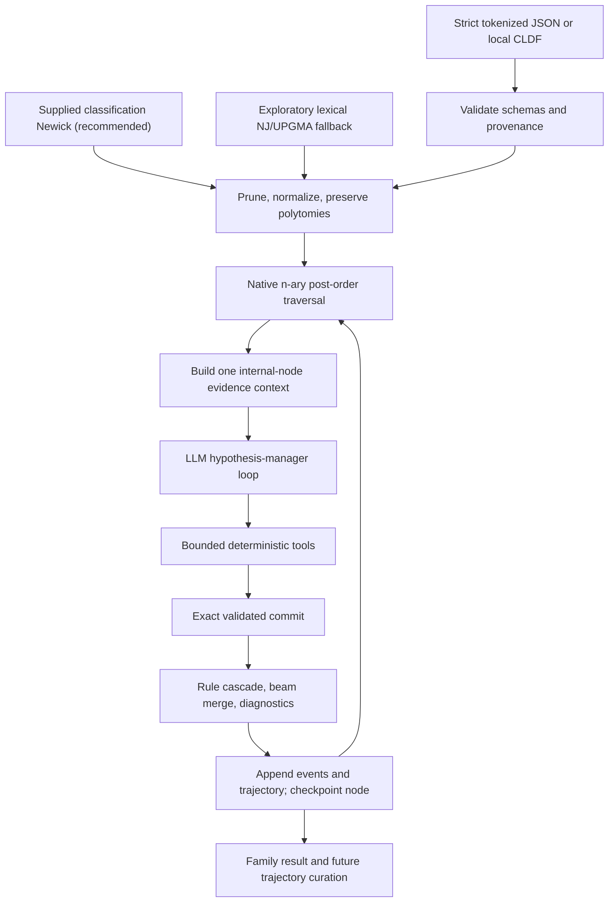

# Cognate Reconstruction Harness

> Current-state guide for developers and coding agents. Last verified:
> 2026-08-16, package version 0.2.0.

`cognate_reconstruction` is the supported product in this repository. It is
an auditable historical-linguistics harness in which an LLM manages
hypotheses, while typed deterministic code owns evidence access, alignment,
sound-law execution, validation, beam construction, tree traversal, recovery,
and artifacts.

The former product direction—generating Stage-1 cognate-reflex and Stage-2
proto/historical reconstruction JSONL from Lexibank—is archived in the
[predecessor repository](https://github.com/acraevschi/llm_cognate_reflexes).
That code and its generated corpora are useful research history, but they are
not the default workflow and are not equivalent to the multi-turn tool
trajectories produced by the harness.

## Project contract

The intended division of responsibility is:

- the human supplies tokenized lexical evidence and, for research use, an
  independently justified classification tree;
- the LLM inspects bounded evidence, proposes child-to-parent sound rules,
  tests them through constrained tools, and commits a hypothesis;
- deterministic code applies the exact validated rule cascade, constructs a
  parent beam, records diagnostics, checkpoints the completed node, and
  continues upward;
- trajectories preserve the model/tool interaction for audit and possible
  future fine-tuning.



A runtime classification tree is fundamental. The archived
`historical_lineages.csv` and temporal-tree code had a different purpose:
they selected targets for old corpus generation. Curated lineage metadata may
now validate explicit target/anchor bindings, but it never creates or replaces
the runtime classification tree.

## Status at a glance

| Area | Current state | Evidence or boundary |
| --- | --- | --- |
| Core package boundary | Implemented | `cognate_reconstruction` has no runtime imports from `cognate_reflexes`; packaging includes only the supported namespace. |
| Strict custom JSON | Implemented | Pydantic v2 models reject extra or malformed fields; forms are token arrays. |
| Local Lexibank/CLDF | Implemented and smoke-tested | Dataset-scoped IDs, conservative segmentation, cognacy memberships, partial slices, and provenance are retained. |
| Supplied Newick | Implemented and recommended | Quoting, leaf validation, pruning, unary collapse, branch lengths, internal IDs, and unresolved polytomies are supported. |
| Tree induction | Implemented, exploratory | LingPy LexStat SCA distances with neighbor joining or UPGMA; not an independent classification. |
| Historical targets and anchors | Implemented | Strict external anchors and explicit CLDF historical bindings support hidden `target` and visible `anchor` roles. |
| LLM tool loop | Implemented | Ten typed tools, bounded turns/calls, same-session rule validation satisfied by a standalone test or a cascade preview, ordered cascade preview, exact commit checks, rule-specific rejections with remediation, read-only prior-node hypotheses, windowed stall/truncation handling, and superseded evidence dropped from the live prompt. |
| Cost of looking at evidence | Reduced, and measured | A correspondence-set survey over all 46 concepts and ten daughters costs 28 KB. The same ten-node `get_alignments` request that returned 3034 KB for six concepts now returns 314 KB, and 782 KB for the 24 the raised cap allows. A scripted whole-benchmark run that surveys, re-surveys, and aligns at every one of seven nodes never exceeds a 31.9 KB prompt. See ["the cost of looking at the evidence"](#the-cost-of-looking-at-the-evidence). |
| Deterministic reconstruction | Implemented | Literal token-rule cascades, n-ary beam combination weighted by branch support, named tie-break policy, derivation provenance naming the supporting children, convergence diagnostics, and optional scored anchors. |
| Provider abstraction | Partially production-ready | LiteLLM request/response contract is unit-tested; LM Studio discovery and small live tool runs have worked. Model/provider reliability is not guaranteed generically. |
| Observability and recovery | Implemented with limits | Console and JSONL events, failed trajectories, transient retries, run limits, and completed-node checkpoints. A failed node is recorded and walked over with a marked identity fallback rather than ending the run; `--fail-fast` and `--max-failed-nodes` bound that. No mid-node resume. |
| Trajectory curation | Implemented at a mechanical level | Version 2.0 validation, summaries, workflow-quality filtering, and generic tool-training export. No expert linguistic grader or deterministic replay command. |
| Research-grade evaluation | Partial | Exact held-out historical target evaluation exists; broad curated family benchmarks and a validated quality objective do not. Graded metrics (edit distance, B-Cubed) are still absent, so a near-miss and an unrelated form score alike. |
| Reconstruction quality | Measured, partly improved, still bounded by the harness | `tools/` scores the deterministic layer against gold Proto-Polynesian. With oracle rules on every branch the correct form is in the beam 84.8% of the time and is now reported 58.7% of the time, up from 54.3% once branch support reached the score — top-1 rose at every beam width and beam-exact fell at none. **26 points are still lost in how a parent is chosen from child evidence, after the model has finished.** Most of the remainder sits at binary nodes, where support cannot separate two children that disagree one-to-one. See [the analysis tools](docs/analysis_tools.md). |
| Training backend | Not implemented | Trajectory export is the boundary for later work; no TRL/Unsloth training pipeline is included. |
| Human-facing run report | Implemented, static | `inspect-run` prints a per-node and family report, optionally as one self-contained HTML file, including report-only cross-node observations. There is still no interactive trace browser, and the turn-by-turn timeline lives in the run-triage skill. |

The harness is ready for controlled local experiments and deterministic
development. It is not yet a system whose mechanically accepted
reconstructions should be treated as historically correct without expert
review.

## Repository map

```text
cognate_reconstruction/
├── schemas/            strict serialized contracts
├── ingestion/          custom payload, CLDF, compatibility, tree preparation
├── tree/               self-contained Newick model and n-ary post-order walk
├── alignment/          typed LingPy SCA wrapper and correspondence-set aggregation
├── rules/              literal sound-law parser and token engine
├── traversal/          beams, deterministic reconstruction, checkpoints
├── inspect_run.py      readable run report and cross-node observations
└── agent/
    ├── providers/      provider protocol and LiteLLM adapter
    ├── tools/          deterministic model-facing tools
    ├── SKILL.md        hypothesis-manager instructions
    ├── error_codes.py  closed rejection vocabulary and its classification
    ├── orchestrator.py bounded/retrying model loop
    ├── events.py       console and JSONL events
    └── trajectory.py   versioned audit/training artifacts

tests/workbench/        supported product tests
examples/               strict JSON, anchor, tree, and minimal CLDF fixtures
tools/                  unowned analysis scripts; no LLM, no network
docs/running_inference.md
docs/analysis_tools.md
MIGRATION.md
```

`tools/` is deliberately outside the package. The test suite proves the harness
is mechanically correct and says nothing about whether it reconstructs *well*;
these four scripts measure the second thing against a gold proto-language, and
`tools/build_polynesian_benchmark.py` rebuilds the benchmark they all read. They
are analysis instruments rather than product surface: not importable, not
covered by the suite, and safe to change. See
[the analysis tools](docs/analysis_tools.md) for what each measures, the current
baselines, and when to re-run them.

Start with:

- [the full inference/CLI guide](docs/running_inference.md) for schemas,
  commands, provider options, and artifact contracts;
- [the analysis tools](docs/analysis_tools.md) for the reconstruction-quality
  measurements, including the oracle ceiling that bounds what any model can
  score under the current architecture;
- [report, reject, or score](docs/report_reject_or_score.md) for where a new
  signal belongs — the reasoning behind the mechanical/workflow/linguistic
  split, and why a report and a gate are different kinds of decision;
- [the migration note](MIGRATION.md) for what moved and why;
- [the agent instructions](cognate_reconstruction/agent/SKILL.md) for the exact
  comparative-method and tool-use policy; and
- [the archive boundary](#archive-boundary) before reviving any archived corpus
  code from the predecessor repository.

## Installation and development environment

Python 3.11 or newer is required. Repository validation uses the
`llm_reconstruction` Conda environment.

```bash
conda env update -f environment.yml --prune
make install
make test
```

`environment.yml` installs the editable core package, but not the optional
LiteLLM dependency. Run `make install` (equivalent to installing
`-e '.[agent]'`) before real inference. Core deterministic tests can run
without a live provider.

Useful Make targets:

```bash
make help
make test
make smoke-lexibank
make smoke-iecor-historical
make cli-help
```

`make smoke-iecor-historical` additionally requires the user-managed,
git-ignored checkout at `data/lexibank/iecor`; it is not a fresh-clone smoke
test.

## Quick start

### 1. Reproduce local CLDF preparation

The checked-in fixture needs no download:

```bash
make smoke-lexibank
```

This lists exact dataset-scoped variety IDs and writes a validated workbench
payload to `/tmp/cognate-reconstruction-fixture.json`.

### 2. Run strict custom JSON through a generic LiteLLM provider

A small example is checked in at
[`examples/reconstruction_input.json`](examples/reconstruction_input.json).

```bash
export MY_PROVIDER_API_KEY='...'

conda run --no-capture-output -n llm_reconstruction +  cognate-reconstruct infer +  --input examples/reconstruction_input.json +  --model '<litellm-model-identifier>' +  --api-key-env MY_PROVIDER_API_KEY +  --output runs/example/result.json +  --trajectories runs/example/trajectories.jsonl +  --events runs/example/events.jsonl +  --checkpoint runs/example/checkpoint.json
```

Use a fresh trajectory/checkpoint path for a new experiment. Trajectories and
events are append-only, while an existing checkpoint requires `--resume`.

### 3. Run a loaded LM Studio model

LM Studio is a preset, not the conceptual default provider:

```bash
conda run --no-capture-output -n llm_reconstruction +  cognate-reconstruct lm-studio-models

LM_RUN_DIR="runs/lm-studio-$(date +%Y%m%d-%H%M%S)"
mkdir -p "$LM_RUN_DIR"

conda run --no-capture-output -n llm_reconstruction +  cognate-reconstruct infer +  --preset lm-studio +  --model '<loaded-tool-capable-model-id>' +  --input examples/lm_studio_smoke_input.json +  --output "$LM_RUN_DIR/result.json" +  --trajectories "$LM_RUN_DIR/trajectories.jsonl" +  --events "$LM_RUN_DIR/events.jsonl" +  --checkpoint "$LM_RUN_DIR/checkpoint.json" +  --temperature 0 +  --max-turns 16 +  --max-tool-calls 32
```

The CLI is verbose unless `--quiet` is supplied. With `conda run`, keep
`--no-capture-output` so events stream immediately.

Provider options such as `max_tokens` are model-specific. In particular,
[`examples/lm_studio_qwen_config.json`](examples/lm_studio_qwen_config.json)
is a deliberately bounded 1,024-token example. Reasoning models may spend that
entire allowance before emitting a tool call. Do not reuse it when unrestricted
reasoning/output is intended.

## Input contracts

### Strict workbench JSON

`infer` accepts a `WorkbenchPayload` containing:

- at least two `LanguageLexicon` objects;
- immutable `LexicalForm` records with exact `variety_id`, `concept_id`,
  and non-empty tokenized `segments`;
- optional concept metadata;
- a supplied `newick`, or an explicitly exploratory `tree_method`; and
- optional embedded historical target/anchor bindings.

Rules and alignments operate on tokens, not Unicode characters. `+` and `-`
are structural morphological boundaries. Raw orthography is never
automatically split into segments.

### Local Lexibank/CLDF

The supported adapter reads existing CLDF. It does not clone a repository or
run `lexibank makecldf`.

```bash
cognate-reconstruct list-lexibank-varieties +  --dataset examples/lexibank_fixture

cognate-reconstruct prepare-lexibank +  --dataset examples/lexibank_fixture +  --newick-file examples/lexibank_fixture/tree.nwk +  --concept-id 948 +  --concept-id 221 +  --output runs/fixture-input.json
```

Important ingestion guarantees:

- variety, fallback concept, and cognate-set IDs are dataset scoped;
- source Glottocode and tree Glottocode remain separate;
- segmentation uses CLDF `Segments`, then `Phonemic_Segments`, and skips
  rows that have neither;
- all CognateTable membership rows are retained;
- standard `Segment_Slice` values are validated and normalized to zero-based
  token positions while preserving the original notation and source row;
- multiple whole-form memberships remain explicit alternative analyses; no
  unrecorded primary choice or weight is invented;
- custom morpheme-indexed partial-cognacy conventions currently recognized for
  `liusinitic` and `tuled` are tagged as compatibility rules;
- `tlopo` and `tuled` tree-Glottocode repairs are narrow and auditable; the
  legacy heuristic `sidwellvietic` cognate relinking is not applied.

Repeat `--variety-id` and `--concept-id` to bound an experiment. Unknown
IDs and selections that leave a variety without tokenized cognate evidence are
rejected.

### Classification trees

A supplied classification Newick is the recommended research path.

- leaf labels must be exact dataset-scoped variety IDs;
- missing selected varieties are errors;
- extra branches without selected lexical evidence are pruned;
- unary nodes created by pruning are collapsed;
- quoted labels and unresolved polytomies are preserved;
- named internal nodes are strongly recommended when anchors, historical
  targets, checkpoints, or stable result IDs matter;
- unnamed internal nodes receive deterministic path IDs such as
  `internal:root.0`.

When no Newick is supplied, the harness can induce a lexical NJ or UPGMA tree
using LingPy LexStat SCA distances. This is an exploratory convenience. It
must not be reported as equivalent to an independently justified
classification.

### Historical forms: hidden targets versus visible anchors

Historical forms can be removed from observed leaf evidence and explicitly
bound to a named internal node:

- `target`: hidden from the model and evaluated after deterministic
  reconstruction with exact top-candidate and beam-level token matches;
- `anchor`: included in the prompt/tools/trajectory and handled according to
  `ignore`, `advisory`, or `scored`.

Use either:

- [a strict JSON binding file](examples/historical_bindings.json);
- the curated `data/historical_lineages.csv` plus an explicit role; or
- [an external anchor file](examples/anchors.json) passed to `infer`.

Node IDs, concepts, form ownership, tokenization, and provenance are validated.
The lineage CSV only checks ancestry/branch declarations against a separately
supplied tree; it never determines live traversal order.

Anchor policies are:

- `ignore`: retain anchor provenance in prompt/trajectory, but exclude it
  from deterministic rule reports and scoring;
- `advisory`: report exact matches/mismatches without changing scores;
- `scored`: add the explicit `log(anchor_match_factor)` boost for a unique
  exact match.

## The LLM hypothesis-manager loop

The model receives compact active-child summaries and explicit anchors, then
retrieves evidence incrementally. It cannot execute arbitrary code.

| Tool | Purpose and deterministic boundary |
| --- | --- |
| `summarize_correspondences` | Survey every recurring correspondence set over the whole evidence set at once, ordered by support, with the tail below `min_support` counted rather than hidden. |
| `list_concepts` | Paginate concept IDs, glosses, counts, and available nodes. |
| `search_forms` | Filter exact forms by semantics, tokens, cognacy, node, relation, or position. |
| `list_available_nodes` | Show observed and already reconstructed evidence nodes, including descendants/outgroups and which have a retrievable hypothesis. |
| `get_node_reconstruction` | Return the rules, anomalies, and summary committed at one already-reconstructed node, read-only. |
| `get_alignments` | Produce LingPy n-way SCA alignments once, plus one pairwise correspondence view per node pair referencing them by ID, for an explicit bounded selection. |
| `segment_morphemes` | Create an immutable boundary-only overlay; phonetic tokens cannot be changed. |
| `test_sound_law` | Parse one literal child-to-parent rule and return exact per-form applications and failures. |
| `test_rule_cascade` | Preview the complete ordered branch-scoped cascade, every intermediate diff, and final forms. |
| `commit_reconstruction` | Accept only exact same-session validated rules, scopes, order, overlay, support, anomalies, and node ID. |

A rejected tool call returns `{error_type, message, code, remediation}`.
`remediation` is deterministic text derived from recorded session state — for a
rejected commit it lists every `(validation_call_id, dsl, source_child_ids)`
triple the session recorded — so a model that has to join two records is shown
the join key instead of a bare Pydantic dump. When the rejection is about one
specific rule, the remediation leads with *that rule*: its own DSL, the
recorded validations that are near matches for it, and the call that would
unblock the commit. A model that refined an overapplying rule has moved past
everything in the catalogue, and reading the catalogue again told it nothing.

`code` is a stable machine identifier for *what was wrong*, drawn from the closed
vocabulary in
[`agent/error_codes.py`](cognate_reconstruction/agent/error_codes.py). Schema
rejections derive theirs structurally from the sorted set of
`(field location, error type)` pairs with list indices collapsed, so
`rules.0.confidence` and `rules.1.confidence` both render as
`schema:rules[].confidence=missing`. The code is used only for counting and
matching — repeated-failure detection, the failure taxonomy, and the
exploratory/protocol split. Humans and the model still read `message`, which is
unchanged and complete; that separation is why collapsing two distinct problems
into one code costs nothing in auditability.

### The commit contract

`commit_reconstruction` requires per rule only the `dsl`, the
`source_child_ids`, and the model's own `confidence`:

- `validation_call_id` may be omitted. The harness then resolves it by looking
  for a successful same-session validation whose parsed rule, child scope, and
  segmentation overlay are all identical to the committed rule. **The
  same-session-validation invariant is unchanged** — resolution removes the
  transcription step, not the check. The resolved ID is written into the stored
  request, along with `validation_kind`, so the trajectory stays explicit about
  which validation was used and what kind of call it was.
- **A `test_rule_cascade` preview validates each rule it contains.** The cascade
  applied that rule to the same forms and returned its diff, which is the
  evidence the per-rule requirement exists to guarantee, and it did so *in the
  committed order* — strictly more evidence than a standalone test, not less.
  Before this, the workflow the instructions prescribe had no legal path through
  the commit contract: step 9 asks the model to refine an overapplying rule, a
  refined rule first exists inside the cascade preview, and only a
  `test_sound_law` call counted. A live Tahitic node validated `ʔ > k` and
  `ʔ > ŋ`, watched them collide in the cascade, refined them into `ʔ > k / _i`,
  `ʔ > ŋ / i_o`, and `ʔ > ŋ / i_a`, and was rejected four times for doing
  exactly what it was told to do until the stall detector ended the node.
- **A rule is matched by what it does, not by how it was spelled.** `t > k` and
  `t > k / _` parse to the same target, replacement, and empty environment —
  the engine cannot tell them apart — so the match key is derived from the
  parse. `rule_id` stays lexical, because it is persisted in trajectories and
  normalizing it would rewrite existing records. No rule semantics change; only
  the identity used for matching does.
- **Two validations are ambiguous only when a reviewer could act on the
  difference.** The match key is already the rule, the child scope, and the
  overlay, and a node's forms do not change inside a session, so the only thing
  a commit can differ by is which forms the rule applied to. When that agrees,
  the records are one experiment run twice — a model re-testing while
  iterating — and the old rejection asked for a choice with no content. Matches
  that agree resolve deterministically, preferring a cascade record (so the
  bound record is the one that exercised the committed order) and then the most
  recent. Matches that disagree are still rejected, and the remediation now
  lists the candidates with the forms each supports rather than the whole
  session catalogue.
- `supporting_form_ids` may be omitted and defaults to the resolved
  validation's forms. Those are deterministic engine output, not a model claim;
  a supplied list must still be a subset of them, and a rule that applied to no
  form is still rejected.
- `rationale` is optional **on a single-rule commit**. The required top-level
  `summary` carries the reasoning for the one rule, and no deterministic check
  consumes per-rule prose. On a commit carrying **more than one** rule every
  rule must supply one, and a commit missing any is rejected with a remediation
  naming the exact `rule_id`s. The schema keeps the field optional and the tool
  enforces the multi-rule case, so records written before the rule stay
  loadable. The asymmetry is deliberate: the measured transcription friction
  that made `rationale` optional was entirely on single-rule commits, while a
  single `summary` cannot attribute reasoning to one of several rules — and a
  corpus filter that has to discard *every* multi-rule commit for missing
  reasoning is a worse outcome than one extra required string on a rare call.
- `confidence` stays required: it is a model judgement that the beam consumes as
  a score weight, and defaulting it would invent a claim the model never made.

### The cost of looking at the evidence

A live 10-language, 46-concept benchmark could not be completed in three
attempts, and the proximate cause was not reasoning: it was that **inspecting
evidence cost more context than reasoning about it.** One `get_alignments` call
for six concepts across two languages returned 31 KB and moved a session from
5,003 to 34,286 tokens; by turn 26 a two-language node had reached 109,270 input
tokens and died having never committed. The model inspected 5, 12, 12 and 8 of 46
concepts before committing on the four nodes it reached — not from laziness, but
because it could not afford more.

Three things were wrong, and all three are fixed:

- **Every pairwise view re-embedded the alignments.** With N nodes the same
  alignments were serialized `1 + N·(N−1)/2` times, so ten nodes meant 46 copies.
  `CorrespondenceMap` now carries `alignment_ids` and the alignments are held once
  on the `MultipleAlignmentMap`. A validator keeps every reference resolvable, so
  the ID is a pointer rather than a promise.
- **Every correspondence carried the aligner's whole working trace.** The
  `detail` argument now defaults to `"summary"`: a true occurrence `count` plus at
  most three `(alignment_id, column_index)` references into alignments that are in
  the payload anyway. `detail="full"` still returns every occurrence with its
  neighbouring segments. `CorrespondenceSummary.observations` was renamed to
  `example_observations` and its validator relaxed from `count == len(...)`,
  because the old name and the old check together were what *forced* the trace to
  be present; `count` remains the true count under both renderings.
- **An alignment ID spelled out every participating variety.** Inside a payload
  that lists `variety_ids` once, that was duplication charged once per reference,
  and references are quadratic in the node count. IDs are now
  `msa-<selection digest>:<concept>:<cognate set>`: the selection still has to be
  in the ID, since the same cognate set aligned against different daughters is
  different aligned material.

Measured on the ten-daughter Polynesian benchmark, before and after, for one
fixed request — the benchmark's first six concept IDs, which is why its "before"
is 26.7 KB rather than the 31 KB the live session happened to fetch:

| Request | Before | After (`summary`) | After (`full`) |
| --- | --- | --- | --- |
| 2 languages × 6 concepts | 26.7 KB | 13.6 KB | 17.3 KB |
| 10 languages × 6 concepts | 3034.2 KB | 314.3 KB | 743.4 KB |

`get_alignments` requires an explicit selection of at most 24 concept IDs or
48 exact form IDs. The bound is intentional even when the model has a very large
context window: the model should work through small evidence batches, not load an
entire family at once. It was raised from 12 on the measurement above — 24
concepts cost 41 KB across two nodes and 82 KB across three, which are the widths
a node session actually aligns — and it deliberately bounds *concepts* rather than
bytes, because at ten nodes the pairwise views dominate and doubling the concept
list only adds 42% (551 KB → 782 KB). A wide survey belongs in
`summarize_correspondences` instead, which covers all 46 concepts across all ten
daughters in 28 KB.

### The correspondence set

The object a comparative linguist works from is the **correspondence set**: the
n-tuple of aligned segments across every daughter, with the count of aligned
columns showing it. It had no representation anywhere in the codebase, so
recurrence — the thing that separates a sound law from residue — was invisible in
any single batch of alignments.

`summarize_correspondences` returns it over the whole evidence set at once, which
is why it has no batching bound on its input and bounds its *output* by
pagination instead. For the ten Polynesian daughters that is 216 distinct sets
over 56 cognate-set alignments, 41 of them attested more than once:

```text
n   EFut EUve  Haw  Mri  Niu  NMq  Rar  Sam  Tah  Ton
9      t    t    k    t    t    t    t    t    t    t
8      l    l    l    r    l    ʔ    r    l    r    l
4      k    k    ʔ    k    k    ʔ    k    ʔ    ʔ    k
3      ʔ    ʔ    Ø    Ø    Ø    Ø    Ø    Ø    Ø    ʔ
3      f    f    h    h    f    h    ʔ    f    h    f
```

`min_support` defaults to 2 and the 175 singletons are reported as
`suppressed_below_min_support` rather than dropped silently, because a
correspondence occurring once is residue — compound material, a loan, a
segmentation artefact — and a model that sees thirty rows has to know there is a
tail. An optional `segment` filter, with `segment_node_id`, answers "every set in
which Tongan shows `ʔ`", which is how a merger gets polarized; `Ø` asks for a gap,
as in the DSL.

`ReconstructionStep.correspondence_maps` is populated from the same compact
rendering. It had been declared, serialized as `[]` into every artifact by every
run, and populated by nothing, which made a reconstruction impossible to audit
against its own evidence.

The cost, measured on a scripted whole-benchmark run over the seven-node
Polynesian tree: **448 KB of a 10,017 KB `result.json`, or +4.5%.** A
`ReconstructionStep` is serialized twice — once in `snapshot.steps` and once as
the completed trajectory's `reconstruction_step` — so the maps appear 14 times for
7 nodes, and 232 KB on the 2222 KB snapshot alone is *half* the real figure.
Checkpoints carry the same steps and grow with them. On the three-child example
fixture it is 3.0 KB per node. The maps are recorded only when the traverser
supplies an evidence context, so a deterministic caller that passes none — such as
the analysis scripts in `tools/` — still gets `()` and pays nothing. Nothing in it
reaches a rule, a candidate, or the beam.

### Trimming the live prompt

Nothing was ever released from the orchestrator's `messages`: an alignment
payload fetched on turn 4 was still charged on turn 26. When a read-only evidence
call re-requests a selection an earlier call already covered in full, that earlier
tool message is now replaced in the *live prompt* by
`{"compacted": true, "tool": ..., "call_id": ..., "superseded_by": ...}`.

The rule is deliberately strict, because taking back evidence the model may still
be reasoning from is worse than paying for it. Supersession requires the later
call to cover the earlier selection completely — concepts 1 and 2 followed by
concepts 3 and 4 supersedes nothing — and every non-selection argument, including
pagination and `detail`, must match exactly. The most recent result for a tool is
never compacted, so the model never ends a turn with no copy of what it asked
for; rejections are never compacted, since they carry the correction; and
`test_sound_law`, `test_rule_cascade`, `segment_morphemes`, and
`commit_reconstruction` results are never eligible at all, because a validation
ID, an overlay ID, and a commit are not re-derivable from a later call. Only
message *content* is replaced, so every tool call is still immediately followed by
its own tool message.

**The trajectory keeps the full content.** The audit record and the live prompt
are deliberately allowed to diverge — a trajectory whose results had been replaced
by placeholders would be worthless both as a record and as supervision — and the
`context_compaction` events plus the per-node `compacted_tool_results` metric say
where they differed, so a session that only fit inside its context because the
harness dropped evidence is legible as such.

### What crosses a node boundary

Every node gets a fresh conversation: the orchestrator rebuilds `messages` from
the instructions plus that node's payload, and `AgentContext` — validations,
overlays, commit — is new. That is deliberate, and it is what makes each
trajectory one independent tool-use example.

Two things cross the boundary, both read-only and both pulled by the model
rather than pushed into the prompt:

- reconstructed lexicons, reachable through `list_available_nodes` and
  `search_forms(scope="available_tree")`, as before; and
- the hypothesis committed at an already-reconstructed node — its rule DSL,
  child scope, confidence, anomalies, and summary — through
  `get_node_reconstruction`, one node per call.

The second exists because the comparative method is iterative: a correspondence
established at one node constrains its neighbours, and without this every
internal node of a 170-concept family re-derives the same correspondences while
nothing showed the model that its neighbours had claimed something
incompatible. A prior node's rule is a *hypothesis*, on the same footing as a
reconstructed form not being direct attestation. **It has no effect on
scoring.** Whether a parent's confidence should propagate into a child's beam,
or cross-node inconsistency should be penalised, changes what counts as a valid
reconstruction and is listed under decisions requiring research-owner input.

After a run, `inspect-run` reports the same relationships from the other
direction: it compares committed rule inventories across nodes and prints what
it finds for a human. That is also report-only — see "Inspect one run".

Visibility is gated on the traverser's reconstructed-evidence set, which
post-order populates only after a node completes, so nothing leaks from a node
that has not been reconstructed yet. Session-local identifiers — validation call
IDs, supporting form IDs, overlay IDs — are excluded, because they mean nothing
in another session.

Both survive `--resume`. Reconstructed lexicons always did, because they derive
from the `ReconstructionStep`s in the checkpoint; committed hypotheses lived
only in the reconstructor for the life of one process, so a resumed run used to
lose half of what crosses a node boundary without saying so. `infer --resume`
now reads `trajectories.jsonl` back and reseeds them, which promotes that file
from a write-only audit artifact to a readable input.

A trajectory is seeded only if it is **all four** of:

- completed, with its `committed_reconstruction` present;
- for a node in the checkpoint's completed set — a node that will be re-run is
  not seeded, since it must not read a hypothesis for itself;
- written under the same `configuration_sha256` as the current run, so a
  hypothesis produced under a different model or a different instruction set
  cannot leak into a resumed run; and
- written under the same `run_id` as the checkpoint. The configuration hash
  cannot tell two invocations apart — the same model over the same input with
  the same settings hashes identically — and `--trajectories` defaults to a
  single file in the working directory, so two runs append to it. Without this
  filter a node's lexicon could come from the checkpoint's own step while its
  rules came from a different invocation that happened to be written last, and
  the model would read rules that did not produce the forms in front of it.
  `--run-id` cannot change during `--resume`, so every legitimate record
  already carries the checkpoint's run ID.

The number seeded is printed. A missing or unreadable `trajectories.jsonl`
warns and continues, because a resumed run without prior hypotheses is degraded
rather than broken; a file that fails schema validation is an error, because
silently seeding nothing from a corrupt audit artifact would hide the
corruption. Seeding restores what is *retrievable*; it changes nothing about
the fresh conversation each node gets, and nothing is pushed into any prompt.

A normal successful node session is:

1. list/search evidence;
2. align a bounded representative batch;
3. propose and test every rule;
4. refine weak rules after reading applications, absent targets, context
   mismatches, and anchor mismatches;
5. preview the complete order when multiple rules interact;
6. commit the exact tested hypothesis and explicit anomalies;
7. let deterministic code reconstruct the parent.

## Sound-rule DSL

Rules are operational child-to-parent transformations and are applied exactly
as written:

```text
f > p / #_
k > tʃ / _i
n > m / _p
p > Ø / _#
```

Current semantics:

- targets, replacements, and contexts are literal token sequences;
- multi-token expressions are space-separated;
- `#` is a word edge and `_` marks the target position;
- `+` and `-` may constrain context but cannot be targets or insertions;
- `Ø` or `∅` is deletion;
- rules are an ordered cascade;
- every rule has an explicit active-child scope and model-supplied confidence;
- a rule whose target and replacement are identical is rejected;
- identity reconstruction is represented by `rules: []`.

The engine does not infer inverse historical rules. A non-bijective sound
change cannot be inverted deterministically, so the model must formulate the
required child-to-parent mapping explicitly.

Not implemented in the DSL: feature bundles, phonological classes, wildcards,
regular expressions, optional segments, backreferences, empty-target
insertion, non-local environments, or automatic rule inversion.

## Deterministic beam and diagnostics

For each concept:

1. observed leaf variants begin as an equal-mass distribution;
2. branch-scoped rules transform retained child candidates in order;
3. child log scores and the confidence of rules that actually applied are
   combined;
4. each distinct parent output takes the share of its state's mass matching the
   share of active children that produced it;
5. exact scored-anchor matches optionally add the configured boost;
6. identical outputs are merged with log-sum-exp, normalized, and pruned to
   `beam_width`.

Every candidate retains derivation and child-candidate provenance, including the
child IDs whose cascade produced exactly that form. The output probabilities are
normalized heuristic beam mass, not calibrated Bayesian posteriors. Model
confidence, the branch-support weight, and the optional anchor boost are
operational scoring choices rather than a validated linguistic theory.

### Branch support, and how equal scores are broken

Step 4 is the rule that decides which parent form a node reports when its
children disagree. It is `log(support) - log(total_support)`, where `support` is
the number of active children whose scoped cascade produced that exact form and
`total_support` is the number folded into that combination state. Mass is
therefore redistributed among a state's outputs in proportion to branch support,
and the state's total is unchanged.

This replaced a flat `-log(len(outputs))` applied identically to every distinct
output. The old rule was a strict special case of the new one: where every
output has equal support the two agree exactly, which includes every binary node
whose two children disagree. They differ only where the old rule scored a form
four branches attest and a form one branch attests identically — and, because
`normalize_and_prune` sorted equal scores by the segment tuple, let Unicode order
pick the winner. Renaming the minority segment from `ʔ` to `W` in
`tools/tiebreak_probe.py` was enough to flip which form the node reported.

It is still an operational heuristic and not a probabilistic model of sound
change. Branch agreement is evidence in the comparative method, but the number
of daughters showing a form is not its posterior probability: a shared
innovation is attested by every branch that inherited it, which is why a naive
per-column majority vote across children scores *worse* than this — eight of ten
Polynesian daughters lost `*ʔ`, so the majority is wrong exactly where the
reconstruction is interesting. Support weights candidates; it does not
adjudicate them.

Ties still happen — two branches, one form each, is the common case — and how
they resolve is now a named policy rather than a side effect. `TIE_BREAK_POLICY`
in `traversal/beam.py` is **ascending lexicographic order of the segment
tuple**, and it is documented there as deliberately arbitrary: it exists so runs
reproduce, and it carries no linguistic claim. Choosing between equally supported
reconstructions on linguistic grounds is a real and separate problem that belongs
with directionality, not in a sort key.

How often that fires is now counted rather than assumed. `tie_broken_concept_count`
records the concepts whose reported form was picked by segment order, and
`inspect-run` prints it beside the convergence numbers. The beam shows two
probabilities of 0.50 whether a form won on support or on the order of its first
differing segment, so without the count a reader cannot tell an evidenced
reconstruction from a coin-flip. Under oracle rules on the Polynesian benchmark
it fires on 22 of 46 concepts at `tongic`, 18 at `marquesic`, and 16 at
`futunic` — all leaf-adjacent binary nodes.

Each completed node reports:

- committed rule count and structural rule-complexity cost;
- evaluated rule results and successful applications;
- target-absent, context-mismatch, and anchor-mismatch counts;
- mechanical rule coverage over applicable results;
- anomaly count/rate;
- whether the result was an empty identity reconstruction; and
- **child convergence**: `child_convergence_rate`, `divergent_concept_count`
  with a bounded sample of the IDs, `mean_branch_support`, and
  `concepts_inspected` / `concepts_available`; and
- `tie_broken_concept_count`, how many reported forms were chosen by segment
  order rather than by mass.

Rule complexity is diagnostic only. It does not currently change the default
beam score.

### Child convergence

Every counter above except the last group measures the *rules*. None of them
measured whether the children ended up agreeing on a parent, which is the only
thing a reconstruction is for. A node can apply a flawless cascade — full
`rule_coverage`, no anomalies, no protocol failures — and leave every branch
saying something different. One live node committed `f > p / _eː` scoped to
Tongan and `p > f / _e` scoped to Niuean: contradictory claims about the same
correspondence, both validated, both at confidence 1.0, guaranteeing divergence,
and passing every check the harness had.

- `child_convergence_rate` — share of concepts on which every attesting active
  child, contributing its highest-scoring candidate transformed by its own
  scoped cascade, produced the identical parent form. A concept only one child
  attests counts as converged; there is no second branch to disagree with it.
  This is the headline number in `inspect-run`, printed next to `rule_coverage`.
- `mean_branch_support` — averaged over concepts, the share of *all* the node's
  active children standing behind the winning candidate. This is what separates
  "all five children said this" from "one child said this and the rest were
  silent", which the rate alone cannot.
- `concepts_inspected` / `concepts_available` — evidence coverage, derived from
  concept and form IDs named in tool arguments during the session, with a call
  that explicitly scopes to the whole lexicon counting as such. Live runs
  committed on 5, 12, 12 and 8 concepts out of 46 available and nothing recorded
  it.

The same summary is returned to the model, by `test_rule_cascade` per concept
and by `commit_reconstruction` over the whole node, so the session's last
observation is what its hypothesis actually produced rather than only that the
commit parsed.

**Divergence is reported and scored, never rejected.** A linguist may
legitimately commit a hypothesis under which some children disagree — an
unexplained residue belongs in `anomalies`, and rejecting divergence would
reward inventing a rule per exception until everything lines up. For the same
reason convergence is deliberately *not* wired into `high_quality`, which is
documented as protocol hygiene making no linguistic claim. See
[`docs/report_reject_or_score.md`](docs/report_reject_or_score.md).

All convergence fields are `None`-defaulted, so a step written before they
existed loads and reads as "not recorded" rather than as a node on which nothing
ever diverged.

`rule_coverage` is `successful_applications / applicable_rule_results`, where
`applicable_rule_results` excludes evaluated results whose form never contained
the rule's target. An in-scope child that simply never shows the target is
vacuous for that rule, not a counterexample to it, and the old
`successful_applications / rule_results_evaluated` figure therefore measured
scoping convention rather than the rule: `f > p / #_` scoped to three children
scored 0.33 while the identical reconstruction scoped to the one child showing
`f` scored 1.0. Both now score 1.0. `target_absent`, `rule_results_evaluated`,
and `applicable_rule_results` remain visible as raw counts, so a scope wider
than the evidence is still legible — it is just no longer laundered through the
coverage number.

The metric was fixed rather than the instruction. Telling the model in
`agent/SKILL.md` to scope rules only to children that exhibit the target would
depend on the model complying, and would also press it to narrow a *linguistic*
claim about which branches a correspondence holds for in order to satisfy a
*mechanical* counter. That coupling is the defect, not the scope.

## Outputs, recovery, and trajectory curation

A normal run writes four artifacts:

| Artifact | Meaning |
| --- | --- |
| `result.json` | Full traversal snapshot, internal beams/best lexicons, diagnostics, any `node_failures`, and optional historical-target evaluation. |
| `trajectories.jsonl` | Append-only versioned model/tool/commit/deterministic records, one record per attempted node. |
| `events.jsonl` | Append-only chronological operational events for console/application monitoring. |
| `checkpoint.json` | Atomic completed-node deterministic state for resume. |

Every attempted node writes a trajectory, complete or not. What happens to the
*run* when one fails is described next.

### A failed node does not discard the run

A node session that fails — a protocol stall, a loop limit, a provider error —
used to propagate and end the traversal before `result.json` was written. On a
seven-node benchmark that meant three attempts produced nothing evaluable, and
the three clean commits of the first attempt were discarded along with the node
that stalled. It is the build system that deletes every object file because one
translation unit failed.

By default the harness now:

- records the failure — reason, error type, and the failed session's trajectory
  ID — in `result.json` under `node_failures`, and keeps the incomplete
  trajectory in `trajectories.jsonl` exactly as before;
- commits a deterministic **identity fallback** for the node so its parent beam
  is defined and the walk can continue;
- marks the step `diagnostics.failure_fallback`. This is *not*
  `identity_reconstruction`, which says a session looked at the evidence and
  concluded the parent equals its children. Both are true of a fallback step,
  and only the new flag says no reconstruction was ever proposed;
- leaves the node, and every node above it, out of the checkpoint, so
  `--resume` re-runs them;
- emits a `node_fallback` event after the `node_failed` one, so a timeline says
  what the run did next and not only that a session ended.

Nothing lets a fallback read as a reconstruction. The CLI prints
`FAILED NODE <id>` per failure and excludes them from the "reconstructed
internal nodes" count; `inspect-run` opens with a banner naming them, marks the
node `FAILED - IDENTITY FALLBACK`, and subtracts them from its own counts. The
failed trajectory is incomplete, so it carries no deterministic step, fails
`high_quality` on the first reason, and is excluded from `export-trajectories`
unless `--include-incomplete` explicitly asks for incomplete sessions — where
it appears as what it is, a session with no step.

Two bounds:

- `--fail-fast` restores the previous behaviour exactly: the first node failure
  propagates and no `result.json` is written.
- `--max-failed-nodes` (default 3, `0` being equivalent to `--fail-fast`) stops
  a run that is failing everywhere with `TooManyNodeFailuresError`, naming
  every node that died. A run producing an identity tree is not a
  reconstruction and should say so by stopping.

**A run-budget failure is never absorbed into a fallback.** `--max-run-seconds`
and `--max-total-cost-usd` are statements about the whole run, so falling back
over one would spend the rest of the tree fabricating identity nodes and report
a stopped run as a completed one.

### Resume

Resume requires the same main input, normalized tree, non-secret CLI
configuration, agent instructions, tool schemas, and `--anchors` file. When any
of those changed, the run refuses and the message names which. The thresholds
that decide when the harness gives up are the exception: they are recorded,
reported when they change, and never grounds to refuse — see "Resume and budget
integrity" for why that asymmetry is the right one.

```bash
cognate-reconstruct infer +  ... +  --checkpoint runs/family/checkpoint.json +  --resume
```

The next unfinished node starts a new model session. There is no partial
message/tool-loop checkpoint. `trajectories.jsonl` is also read back on resume
so the hypotheses committed at already-completed nodes stay retrievable through
`get_node_reconstruction`; see "What crosses a node boundary" for the filters
that decide which records qualify.

Trajectory commands:

```bash
cognate-reconstruct validate-trajectories +  --input runs/family/trajectories.jsonl

cognate-reconstruct summarize-trajectories +  --input runs/family/trajectories.jsonl

cognate-reconstruct export-trajectories +  --input runs/family/trajectories.jsonl +  --output runs/family/high-quality-examples.jsonl +  --high-quality-only +  --max-anomaly-rate 0.1
```

The current `high_quality` flag is a conservative workflow filter. It requires
a completed deterministic step, evidence inspection, same-session validation
for committed rules, a cascade preview for multi-rule commits, no no-op rules,
and a *protocol*-failure rate at or below `MAX_PROTOCOL_FAILURE_RATE`. It does
not grade linguistic truth. An inspected empty identity commit can pass without
a sound-law test, although `identity_without_testing` remains visible.

**Not every rejected call counts against the flag.** Each rejection is
classified by its error code as `exploratory` or `protocol`:

- **exploratory** — `dsl-parse-error`, `no-op-rule`, and `empty-scope`. The
  model proposed a sound law, the deterministic parser refused it, and the model
  refined. That is the hypothesis loop working, and charging for it would score
  a model that explores below one that never explores — backwards for a corpus
  meant to teach tool use.
- **protocol** — everything else: commit reference errors, unknown tools, and
  every `schema:*` argument-shape rejection. This is friction with no epistemic
  content.

Anything unclassified is protocol; the split fails closed, and a test asserts
that every code in the vocabulary is classified explicitly.

`AgentNodeMetrics` records `failed_tool_call_count` (the total),
`protocol_failure_count`, `tool_failures_by_type`,
`truncated_response_count`, and the two truncation-recovery counters
`forced_tool_choice_count` and `truncation_backoff_applied`;
`protocol_failure_rate` is
`protocol_failure_count / tool_call_count`. `tool_failures_by_type` keys on the
structural error code, so a real run now reports
`{"schema:rules[].confidence=missing": 4}` rather than `{"ValidationError": 4}`.
The field name is unchanged deliberately: records written days ago already carry
it, and `extra="forbid"` would make a rename unloadable — a purely cosmetic gain
against a real loss of append-only auditability.

**The threshold is 0.25, and it is a workflow heuristic rather than a linguistic
judgement.** A session may misstep once and recover; a session that spends most
of its budget being rejected by the tool schemas is a poor tool-use example
whatever its linguistics, and exporting it for later fine-tuning would teach the
wrong protocol. A rate is used rather than an absolute count so the gate does not
tighten as sessions get longer — and a floor of one protocol failure keeps it
from tightening as they get *shorter*, since a three-call identity commit
otherwise hits 0.33 on a single slip. A session passes when it has at most one
protocol failure **or** a protocol rate at or below the threshold.

These fields are additive and defaulted, so trajectories written before they
existed still load and keep the verdict they already had. `protocol_failure_count`
defaults to `None` rather than `0`, and that distinction is load-bearing: an
older record has a real `failed_tool_call_count` and no protocol count, so
reading the absent counter as zero would hand it "zero protocol failures" and let
a trajectory that legitimately failed the gate start passing it. With `None` the
rate falls back to `failed_tool_call_count / tool_call_count` and the record
keeps its original verdict, which the suite checks against every
`runs/*/trajectories.jsonl` present locally.

**The versioning rule: bump `schema_version` when a reader must behave
differently, never merely because fields were added.** The new fields are
additive with defaults, so every 2.0 file — old and new — validates against the
same literal, and each record already carries a `trajectory_schema_sha256` that
changes precisely when the schema does. Bumping the literal would fork the
readable-version set without adding information that hash does not already give.
The asymmetry that decides it is that bumping later is trivial — widening
`Literal["2.0"]` to `Literal["2.0", "2.1"]` keeps every existing file loadable,
and a test asserts exactly that — while un-bumping after files exist in the wild
is not: those files are already written, already say `2.1`, and every reader
that has to accept them inherits the fork forever.

What the literal cannot tell a curator is which 2.0 record carries the new
counters. `summarize-trajectories` therefore reports `schema_variants`: record
counts grouped by `trajectory_schema_sha256`, with the digest this build writes
marked `current` and repeated as `current_trajectory_schema_sha256`. That is the
legibility a version string would have given, at finer granularity, out of data
every record already carries.

`validate-trajectories` means that each JSONL record satisfies the versioned
schema and outcome invariants. It does not re-execute every recorded tool call
or independently reproduce the deterministic step.

### Inspect one run

```bash
cognate-reconstruct inspect-run --run-dir runs/family
cognate-reconstruct inspect-run --run-dir runs/family --html runs/family/report.html
```

`inspect-run` reads `result.json` and `trajectories.jsonl`, plus `events.jsonl`
when present, and prints a readable report: per node the session shape (turns,
tool calls, rejections split protocol/exploratory and grouped by structural
error code, truncations and recoveries, retries, duration, tokens), the
committed hypothesis (each rule's DSL, child scope, confidence, resolved
validation, supporting-form count, rationale, plus anomalies and summary), the
deterministic diagnostics, the best reconstructed lexicon, and `high_quality`
**with the specific condition it failed**. A family summary and any held-out
historical target evaluation follow. `--html` writes one self-contained file —
no external CSS, JS, fonts, or images — readable in light and dark, with wide
rule tables scrolling inside their own container. `--all-forms` lifts the
40-form-per-node cap.

The quality reasons are the gate itself rather than a description of it:
`high_quality` is true exactly when `high_quality_failure_reasons` is empty, so
the report cannot drift from the filter curation applies.

A missing `events.jsonl` only drops the event counts; a missing `result.json`
falls back to the beams recorded in the trajectories, so a run that failed
before writing a result is still readable.

**Cross-node consistency is reported and nothing more.** The last section walks
the committed rules across nodes and observes three things: one DSL committed at
several nodes with materially different confidence, adjacent nodes mapping the
same target in the same environment to different things, and a correspondence
established below a node that the node itself never mentions. Each is a
mechanical comparison of committed rule text, worded for a human to adjudicate,
and the section says so in its own header. None of it is scored, none of it
reaches `high_quality` or the beam, and whether cross-node inconsistency should
ever affect scoring stays in "Decisions that require research-owner input". A
live two-node run illustrates why the wording matters: `PROTO` committed an
identity reconstruction because `INNER` had already completed `f > p`, and the
observation that `PROTO` never mentions that correspondence is a description of
a correct run, not a complaint about it.

`inspect-run` is the supported artifact-facing report. The run-triage skill's
`driver.py triage` is the event-facing one — the turn-by-turn timeline and the
failure taxonomy read out of `events.jsonl`, which is the only source for runs
written before failure counters existed — and it shells out to `inspect-run` for
the artifact sections rather than keeping its own copy of them.

Note that `result.json` is written with computed fields included, so it does not
round-trip through its own `extra="forbid"` model. `inspect-run` therefore reads
it as JSON and validates the fragments it uses (`best_lexicon`, the historical
evaluations) individually. Nothing depends on this, but a future reader that
tries `FamilyReconstructionResult.model_validate_json` on a real result file
will be rejected.

### Inspect artifacts with `jq`

For anything the report does not cover, or on a machine without the harness
installed:

```bash
RUN_DIR="runs/family"

# Compact operational timeline
jq -r '[.timestamp, .kind, .message] | @tsv' +  "$RUN_DIR/events.jsonl" | less -S

# Committed rule DSL, scope, and confidence
jq -r '
  .committed_reconstruction.request.rules[]? |
  [.rule_id, .dsl, (.source_child_ids | join(",")), (.confidence | tostring)] |
  @tsv
' "$RUN_DIR/trajectories.jsonl"

# Node diagnostics and model-loop metrics
jq '{
  node_id,
  completed,
  failure,
  metrics,
  diagnostics: .reconstruction_step.diagnostics
}' "$RUN_DIR/trajectories.jsonl"

# Best reconstructed forms
jq -r '
  .internal_nodes[] |
  .node_id as $node |
  .best_lexicon.forms[] |
  [$node, .concept_id, (.segments | join(" "))] |
  @tsv
' "$RUN_DIR/result.json"
```

## Verification snapshot

The following was re-run in `llm_reconstruction` on 2026-08-16:

| Check | Result |
| --- | --- |
| Supported suite: `pytest -q -k "not local_run_artifacts"` | **202 passed** (2026-08-17; 178 before the evidence-cost work added 24 cases). This is the authoritative count: it is the fixed suite, and it does not depend on `runs/`. Plain `pytest -q` adds one opportunistic case per `runs/*/trajectories.jsonl` present locally, so its total drifts with local evidence — it changed twice during this session's own live runs — and should not be quoted as the suite size. |
| `make smoke-lexibank` | 2 varieties, 4 tokenized forms, 2 concepts; supplied tree normalized successfully |
| `make smoke-iecor-historical` | 6 evidence varieties, 1,029 tokenized forms, 170 concepts, 1 hidden historical binding; supplied tree normalized successfully |
| CLI installation/help | `cognate-reconstruct` available; all eight CLI subcommands load |
| Core/agent versions in the environment | harness 0.2.0, LiteLLM 1.81.16, Pydantic 2.13.4, LingPy 2.6.14 |
| LM Studio discovery | Local `/v1/models` discovery succeeded |
| Archived-code import audit | No runtime import of `cognate_reflexes`; the package has no dependency on archived corpus code |

Re-run on **2026-08-17** for the evidence-cost work. Everything here reads the
Polynesian benchmark rebuilt by `tools/build_polynesian_benchmark.py`; the `make`
targets above were *not* re-run, because every one of them shells out through
`conda run`:

| Check | Result |
| --- | --- |
| Supported suite, and plain `pytest -q` | 202 passed; 223 passed with local run artifacts included, so every checked-in and locally recorded pre-change trajectory still loads |
| `get_alignments`, one fixed six-concept request | 2 nodes 26.7 → 13.6 KB; 10 nodes 3034.2 → 308.8 KB. At `detail="full"`: 17.3 KB and 743.4 KB |
| `get_alignments` at the raised cap | 24 concepts: 41.5 KB over 2 nodes, 82.0 KB over 3, 782.2 KB over 10 |
| `summarize_correspondences` against `tools/correspondence_inventory.py` | Identical: 216 distinct sets over 56 alignments, 41 at support ≥ 2, 175 singletons. 27.9 KB for the whole inventory, 4.8 KB for the default page |
| `tools/oracle_ceiling.py` | Unchanged: top-1 54.3%, beam-exact 84.8%, **selection gap 30.4%** — the beam and scorer were not touched |
| `tools/tiebreak_probe.py` | Unchanged: cases A and B still agree, so nothing is decided by Unicode order |
| Scripted whole-benchmark agent run, 7 internal nodes | 0.6s; largest prompt seen by the provider 31.9 KB with a survey, a repeated survey, and an alignment call at every node; one compaction per node; `correspondence_maps` populated at all 7; `result.json` 10,017 KB of which the maps are 448 KB |
| Live `google/gemma-4-26b-a4b` run on the same benchmark | 4 of 7 nodes committed, against 0–3 in the three pre-change attempts. On `tongic`, which had failed all three times, peak prompt **22,020 tokens against 109,270 before**, and the model opened every node with `summarize_correspondences` unprompted. The run still ends short of the root: `central_eastern` died on `ProtocolStallError` with 8 of its last 9 calls rejected in the commit protocol, so no `result.json` and no held-out accuracy exists for this run. Both remaining failure classes belong to the loop-resilience and directionality work, not to payload cost |

Re-run on **2026-08-18** for the branch-support and convergence work, on the
same Polynesian benchmark:

| Check | Result |
| --- | --- |
| Supported suite: `pytest -q -k "not local_run_artifacts"` | **221 passed** (202 before; 19 new cases for branch support, convergence, evidence coverage, tie-break counting, append-only readability, and the tool-script path binding) |
| `tools/oracle_ceiling.py`, beam width 5 | **top-1 54.3% → 58.7%**, beam-exact **84.8% → 84.8%**, selection gap **30.4% → 26.1%** |
| `tools/oracle_ceiling.py`, widths 1/3/10 | top-1 32.6→47.8%, 54.3→56.5%, 54.3→56.5%; beam-exact 32.6→47.8%, 78.3→78.3%, 84.8→84.8%. Top-1 up at every width, beam-exact down at none — a selection fix, not candidates traded away |
| `tools/tiebreak_probe.py` | Cases A and B now agree: the four-branch form wins both at p=0.80 against p=0.20, where before every candidate scored p=0.50 and case B reported `a W a`. Case C collapses to one candidate at p=1.00 |
| Per-node convergence under oracle rules | Divergence is real and widespread, not an artifact: `child_convergence_rate` runs 0.28–0.63 across the seven nodes, and 23 of 46 concepts diverge at the root |
| Backward compatibility | `tests/workbench/fixtures/trajectory_real_pre_change.jsonl` still loads; its step reports every new diagnostic as "not recorded" rather than as zero |

| Tie-break incidence under oracle rules | 22 of 46 reported forms at `tongic`, 18 at `marquesic`, 16 at `futunic`, 1 at the root — the arbitrary choices are made at the leaf-adjacent binary nodes and harden into mass on the way up |
| `tools/*.py` bind to their own checkout | Running the oracle in a worktree of the pre-change commit now reports `measuring: <worktree>/cognate_reconstruction` and 54.3%, with no `PYTHONPATH` set |

One measurement hazard was found while producing that table and is now fixed
rather than documented as a caveat: `python tools/oracle_ceiling.py` puts
`tools/` on `sys.path[0]`, so the script imported `cognate_reconstruction`
through the editable install — the working tree — even when run from a `git
worktree` of an older commit, and a before/after comparison done that way
silently measured the same code twice. `tools/_bootstrap.py` now puts each
script's own repository root first, and every measurement prints a `measuring:`
line naming the source it loaded. See
[the analysis tools](docs/analysis_tools.md).

The supported suite includes a scripted end-to-end provider that performs
evidence inspection, alignment, sound-law testing, cascade preview, commit,
deterministic reconstruction, trajectory writing, and high-quality export. It
also covers anchors, historical targets, cognate membership/slice handling,
Newick normalization/polytomies, provider request normalization, retries,
failed trajectories, checkpoints, and resume. It additionally covers
validation-call resolution (unique, absent, and ambiguous), commit remediation
text, protocol-failure metrics and the `high_quality` gate, orchestrator stall
and truncation handling, coverage scoping, and backward compatibility.

Backward compatibility is now pinned by a **checked-in real artifact**:
`tests/workbench/fixtures/trajectory_real_pre_change.jsonl` is
`runs/google-gemma-4-e4b-20260815-101423` verbatim — the pre-change
commit-protocol baseline, written by code that had never heard of the fields it
is asserted against. Previously that guarantee rested on globbing gitignored
`runs/`, which meant clearing `runs/` reduced the parametrization to zero cases
and left the suite green with the guarantee silently gone. The glob remains as
opportunistic extra coverage, and the synthetic
`trajectory_pre_failure_metrics.json` remains as the minimal readable case.

`inspect-run` has its own coverage: a scripted two-internal-node run whose
second node deliberately fails the gate, asserting that both nodes are named,
the committed rules and diagnostics are reported, and the specific failing
condition is stated; a run directory with no `events.jsonl`; the HTML output
containing no `http://`, `https://`, `src=`, or `href=`; the cross-node
observations firing on a contradictory adjacent pair and staying silent on a
consistent family; and — the property that matters most — a contradictory family
and a consistent one producing identical `high_quality` verdicts, so the
observations demonstrably score nothing. The multi-rule `rationale` requirement
is covered in both directions, including that the remediation names only the
offending `rule_id`s, and `schema_variants` is covered across a mixed file plus
a widened-literal regression test.

It also covers the structural error codes specifically: that index-normalized
schema codes are deterministic and identical for one mistake repeated at
different list positions, that a scripted provider varying only the *text* of
its rejections now ends in `ProtocolStallError`, that the trailing stall window
forgives widely-spaced repeats but not the same spacing inside one window, that
every code raised anywhere in `agent/` is in the classified vocabulary (read out
of the source by an AST scan, so a new raise site cannot widen it silently), and
that two sessions with the same rejected-call count get opposite `high_quality`
verdicts when one's failures are exploratory and the other's are protocol. It
covers window saturation with a provider that never repeats a code — nine
differently-shaped rejections in rotation — and confirms that the exploratory
one among them occupies a window slot without counting toward the trip. Two
repository-hygiene checks guard the triage driver: its hand-copied exploratory
set must equal the real classification, and the two checked-in copies of the
skill must stay byte-identical.

Truncation recovery is covered by asserting on what the provider actually
received: that the request after a truncated no-tool response carries
`tool_choice="required"`, that a backend raising on `"required"` falls back
within the same turn without an extra stall, that a transient failure on the
forced attempt is still retried as transient rather than silently downgraded,
that forcing happens once per node, that no `max_tokens_override` is ever sent
with backoff off, and — with it on — that the value doubles, clips at the
ceiling, is skipped when the provider reports no output length, never mutates
the adapter's stored options, and lands in the metrics. Resume integrity is
covered end to end through `infer --resume`: a two-internal-node family whose
first node is restored from a checkpoint, whose second retrieves its committed
rules through `get_node_reconstruction`, and the same run without seeding to
show the tool finding nothing. The `clear_run_results` ordering trap has its own
test that pre-seeds, clears, and would fail if seeds were wiped. The filters
each have one: a different `configuration_sha256`, a node absent from the
checkpoint, an incomplete trajectory, a missing file (warns, still finishes both
nodes), and a corrupt file (raises). Editing the agent instructions, narrowing
the tool schema, adding an `--anchors` file, or changing a stall threshold each
make an existing checkpoint refuse to resume and name what changed; changing
nothing still resumes; a checkpoint with no component digests refuses
generically; and the checkpoint's digests are asserted equal to the ones the
trajectory records.

Local ignored live-run artifacts also demonstrate both success and failure:

- `runs/google-gemma-4-e4b-20260815-101423`: the pre-change commit-protocol
  baseline — seven turns, seven tool calls, three of them (43%) rejected
  `commit_reconstruction` schema errors, `coverage 0.33` on a correct
  reconstruction, and `high_quality: 1` despite the failures;
- `runs/google-gemma-4-e4b-20260815-102805` and
  `runs/google-gemma-4-e4b-20260815-103955`: the same input and model after
  this work — four turns, four tool calls, zero rejected, and the identical
  reconstruction in ~45s instead of 99s. The second committed the baseline's
  own broad-scope `f > p / #_` across all three children and scored
  `coverage 1.00` with `target_absent 4` still reported, against the
  baseline's 0.33 for the same rule;
- `runs/google-gemma-4-e4b-20260815-104140`, a two-internal-node run of the same
  lexicons under `(language_a,(language_b,language_c)INNER)PROTO;`: `INNER`
  committed an identity reconstruction and `PROTO` then committed `f > p / #_`
  scoped to `INNER`, giving the correct `p a` / `p u r`. `PROTO` also rejected
  four commits (31%), so the run reports `high_quality: 1/2` — the live form of
  the gate. Those four rejections alternated between two error signatures, which
  is what motivated counting repeats per signature rather than only
  consecutively. Its rejections predate error codes, so triage reports them
  under a `legacy:` prefix derived from the message, which is exactly the
  unstable signature the codes replaced;
- `runs/google-gemma-4-26b-a4b-20260815-185157` and
  `runs/google-gemma-4-e4b-20260815-185318`, after the error-code work: the
  three-language input in 32s over five clean tool calls, and the two-node tree
  in 86s over eight clean tool calls across both nodes, `high_quality: 2/2`.
  Both record `protocol=0`;
- `runs/google-gemma-4-26b-a4b-20260815-210535`, the first live artifact to
  exercise a structural code: the three-language input in 24s over six tool
  calls, the correct `p a` / `p u r`, and one rejected `test_rule_cascade`
  reported as
  `schema:rules=too_short,rules[].validation_call_id=extra_forbidden`. The code
  is legible enough to name the model's actual confusion — it put a per-rule
  `validation_call_id` into a cascade spec, which `CascadeRuleSpec` forbids —
  where the previous taxonomy would have recorded only `ValidationError: 1`.
  One protocol failure in six calls is 0.17, so `high_quality` stays 1/1;
- `runs/google-gemma-4-26b-a4b-20260815-220437`, the same model, input, and
  temperature after `CascadeRuleSpec` gained a docstring saying a cascade rule
  carries no validation ID: five tool calls, none rejected, 20s. The rejected
  cascade call from the run above did not recur. That is suggestive rather than
  conclusive — one trial, and a local server is not bit-deterministic at
  temperature 0 — but the tool schema is the only input that changed;
- `runs/google-gemma-4-26b-a4b-20260815-230711` and
  `runs/google-gemma-4-26b-a4b-20260815-231544`, after the truncation-recovery
  and resume work: the three-language input in 17s over five clean tool calls,
  the same `p a` / `p u r`, `high_quality: 1/1`, `protocol=0`, twice with an
  identical timeline. Nothing was truncated, so no recovery was exercised — the
  point of these runs is that the changed request path did not disturb a clean
  session;
- a live two-internal-node resume under
  `(language_a,(language_b,language_c)INNER)PROTO;` on the same model, run
  outside `runs/`: `INNER` committed `f > p / #_`, its checkpoint was cut back
  to that node, and the resumed process reported `seeded 1 prior committed
  hypothesis` and finished `PROTO`. That model chose not to call
  `get_node_reconstruction` in the resumed session, so retrieval itself is
  demonstrated by the scripted end-to-end CLI test rather than by this run;
  what the run shows is that seeding survives a real process boundary and that
  `summarize_commit` round-trips a real gemma commit;
- `runs/gemma-noop-fix.IKD1kR`: one completed `google/gemma-4-e4b`
  trajectory, five turns, five tool calls, one real rule, and
  `high_quality: 1`;
- `runs/qwen35-tujia-20260810-094347`: a structurally valid failed
  `qwen3.6-35b-a3b` trajectory ending in `AgentLoopLimitError` after
  response truncation prevented reliable tool use; the same run would now be
  retried once with `tool_choice="required"` and, failing that, end in
  `ProtocolStallError` with explicit truncation and recovery events;
- `runs/qwen36-tujia-20260810-102624`: a completed pre-fix trajectory whose
  12 identity-like no-op rules remain audit-readable but now produce
  `high_quality: 0`;
- `runs/google-gemma-4-26b-a4b-20260816-125755` and
  `runs/google-gemma-4-26b-a4b-20260816-125837`, the runs `inspect-run` was
  checked against: the three-language input in 25.6s over five clean tool calls,
  and the same lexicons under
  `(language_a,(language_b,language_c)INNER)PROTO;` in 33.8s over nine clean
  tool calls, `high_quality: 2/2`, `protocol=0`. The second is the one that
  exercised the cross-node section on real output: `INNER` committed
  `f > p / #_` and `PROTO` then committed identity, which the report observes as
  `PROTO` never mentioning a correspondence established below it — correct
  behaviour described neutrally, which is the whole test of the wording.

These `runs/` paths are ignored local evidence and may not exist in another
clone. They are listed to make the current verification history explicit, not
as permanent fixtures.

## What is good enough now

The following components are in a usable state for continued research and
engineering:

- the supported package is self-contained and the old generator no longer
  leaks into runtime imports or packaging;
- strict custom and local CLDF inputs fail loudly instead of guessing;
- supplied-tree validation and native n-ary bottom-up traversal are tested;
- the deterministic tool boundary prevents arbitrary code execution and
  unvalidated non-empty commits;
- exact rule and cascade diffs make mechanical behavior reproducible;
- failed and completed node sessions are auditable;
- long family runs can resume from completed node boundaries;
- the fixture and IE-CoR smoke paths are reproducible;
- trajectories are rich enough to be curated for a later tool-use training
  project without pretending that legacy triplet JSONL is equivalent.

## Known problems and rough edges

These are confirmed behavior or missing safeguards, not merely speculative
future ideas.

### Provider and model behavior

- The generic adapter proves LiteLLM's OpenAI-shaped chat/tool contract, not
  reliable behavior from every LiteLLM provider or every model. A model may
  ignore tools, emit malformed arguments, reason indefinitely, or make weak
  linguistic decisions.
- **A slow turn is indistinguishable from a hung one from the outside, and the
  effective timeout is about 3× what you configured.** Measured 2026-08-17 on a
  live `google/gemma-4-26b-a4b` benchmark run: `model_turn` → `model_response`
  gaps of 1.2 to 7.3 minutes that all returned normally, and one genuine hang that
  surfaced as `litellm.Timeout` after **901 seconds against `--timeout 300`** —
  consistent with LiteLLM retrying internally before raising. The harness handles
  that correctly: the timeout is classified transient, `provider_retry` is
  emitted, and the node fails only after `--max-retries` further attempts. So the
  bound at default flags is roughly 15 minutes per attempt, not infinity.

  Two things are nonetheless missing. The harness cannot interrupt a call in
  flight — `_check_run_budget()` runs before and after an attempt and never
  during it, so `--max-run-seconds` does not end a slow turn — and nothing
  reports "still waiting", so a run that is working normally is
  indistinguishable from a stuck one without reading event timestamps. Both
  knobs that would help (`max_tokens` in `--provider-config`, a lower
  `--timeout`) are hashed into `configuration_sha256` and therefore have to be
  chosen before the first node: they cannot be added to a checkpoint that has
  already run. This belongs with the loop-resilience work; the run-triage skill
  carries the operational procedure meanwhile.
- `finish_reason="length"` is handled explicitly: it emits a
  `response_truncated` event and, when the response carried no tool call, a
  specific instruction to reply with a smaller call. After
  `max_truncated_responses` such responses the node ends in
  `ProtocolStallError`. The harness now also *recovers* rather than only naming
  the condition. Most truncations are the model spending its whole output
  budget on reasoning prose before emitting any call, so the turn immediately
  after a truncated no-tool response is sent with `tool_choice="required"`
  instead of `"auto"` — a change to how the harness builds its own request,
  crossing no configuration boundary. **Every such truncation gets its own
  attempt**, bounded by `--max-truncated-responses`: forcing once per node
  meant the second and third truncated responses drew no intervention at all,
  and the third is the one that ends the node. A backend that *refuses*
  `"required"` is written off for the rest of the node, since it will not
  change its mind; a backend that accepted it and truncated anyway is asked
  again. Every attempt emits a `truncation_recovery` event and is counted in
  `forced_tool_choice_count`, so a session that only reached a tool call
  because the harness intervened does not read like a clean one.
- **The truncation stall names the output lengths it observed.** `max_tokens`
  is the operator's lever and the previous message left them to guess at a new
  value; the error now reports the output token count of each truncated
  response and the largest of them, or says explicitly that the provider
  reported none.
- The optional second recovery **overrides a user-supplied provider option and
  is therefore off by default.** `--allow-truncation-backoff`, which requires
  `--truncation-max-tokens-ceiling`, lets the harness double the effective
  `max_tokens` for the rest of a node after a truncated no-tool response, never
  above the ceiling. The default is off because `max_tokens` lives in the
  user's `--provider-config` and the harness does not own it: a run that
  quietly disagrees with its own configuration is worse than a run that stops
  and says why. The user's stored options are never mutated — the value is
  merged over them for the affected requests only — and the base is the
  truncated response's *reported* output length, so a provider that reports no
  usage gets no backoff at all rather than a raise that might land below what
  the user configured. Each raise is recorded in `truncation_backoff_applied`
  and in the event stream, so a run that only succeeded because of backoff is
  legible in its own trajectory. Note that `--max-truncated-responses` bounds
  how far backoff can ever get: at the defaults the node stops after the third
  truncation, so at most two doublings (4x) apply and a ceiling set higher than
  that is unreachable without raising both. What remains unhandled: a truncated
  response is still discarded rather than continued.
- **Whether truncation recovery should affect `high_quality` is undecided.** A
  session that produced its only tool call because the harness forced one
  currently passes the gate exactly like a session that never needed help. That
  follows from the gate being about protocol failures, and the counters make
  the difference visible, but nobody has decided whether an intervened-upon
  session is the tool-use example the corpus wants to teach. Left open on
  purpose; it belongs with the threshold calibration in "Research validity
  next", not with an engineer's judgement call.
- A tool rejection reproduced `max_repeated_tool_failures` times **within the
  trailing window of `stall_window_calls` tool calls** now triggers one targeted
  correction carrying the tool's remediation, and one further recurrence raises
  `ProtocolStallError`. The signature is `(tool name, structural error code)`,
  so a model that varies its malformed arguments no longer escapes by changing
  the message text. Occurrences are counted across the window rather than only
  in consecutive runs, because a live gemma session alternated between two
  commit errors so that neither was ever consecutive; the window bounds that
  memory so a long, mostly-productive session is not killed by three
  well-separated repeats of one mistake it recovered from each time. Successes
  occupy window slots, which is what makes distance forgivable without making
  density forgivable — resetting on success instead would be fooled by the
  obvious interleave of a bad commit, a good test, and another bad commit.
- A model that never repeats one code is caught by a second condition on the
  same window: when `max_window_protocol_failures` of the last
  `stall_window_calls` calls were *protocol* rejections — whatever their
  codes — the harness injects one correction naming them and then raises
  `ProtocolStallError`. Exploratory rejections are excluded **from this second
  condition only**. They are not excluded from the per-signature rule above,
  which keys on `(tool name, code)` without consulting the category, so a model
  that gets the same exploratory rejection `max_repeated_tool_failures` times
  is corrected and then killed like any other repeat. That is not hypothetical:
  on the 2026-08-17 benchmark run the `tongic` session spent three calls trying
  to express an insertion the DSL cannot represent (`Ø > ʔ / #_`, `∅ > ʔ / #_`,
  `Ø > ʔ`), drew the correction, and stopped one recurrence short of ending the
  node — for proposing the linguistically correct change. What remains
  unhandled: two genuinely different mistakes that happen to share a code are
  counted as one. Triage makes that visible by reporting the
  number of distinct messages behind each code, which is the evidence for
  splitting a code rather than a fault in itself.
- With the currently observed LiteLLM/Pydantic combination, live LM Studio
  calls may print nonfatal `PydanticSerializationUnexpectedValue` warnings.
  Tool execution and normalized trajectories can still succeed, but the noise
  has not been narrowly suppressed or eliminated with a verified dependency
  pin.
- Provider retries cover normalized transient transport/status failures. They
  do not retry a technically successful but linguistically unhelpful response.
- **Two commit-validation rejections used to discriminate where nothing
  distinguished. Both are fixed**, and both were isolated by replaying the
  `central_eastern` session of the 2026-08-17 run, which died with 8 of its
  last 9 calls rejected.
  - `validation-ambiguous` fired whenever a rule matched more than one recorded
    validation, but the match key was already DSL, child scope, and overlay,
    and a node's forms do not change inside a session — so the matches were the
    same experiment run twice. Verified on that run: the two `r > l / _`
    validations serialize identically apart from `validation_call_id`.
    Re-testing a rule while iterating was penalized, and the model that did so
    was pushed onto the explicit-ID path where it then mispaired an ID. Letting
    cascades count would have made it strictly more common. It now rejects only
    when the matches disagree about which forms the rule applied to, which is
    the only difference a choice between them could express.
  - A vacuous environment made a rule a different rule: `t > k` and `t > k / _`
    parse identically but `rule_id` is `sha256` of the source string, and
    resolution compared that string. The same session produced both spellings,
    and `/ _` was the majority style. Matching is now derived from the parse.

  Neither was a soundness problem — no unvalidated rule could be committed — and
  both are described under ["the commit contract"](#the-commit-contract). What
  remains unhandled: `rule_id` is still lexical, so two spellings of one rule
  still produce two IDs in a trajectory. Normalizing it would rewrite records
  that already exist, which is a worse trade than a cosmetic duplicate.

### Resume and budget integrity

- The checkpoint compatibility hash covers the main input text, the normalized
  tree, public CLI/provider options, **the loaded agent instruction text, the
  tool schemas, and the contents of a separate `--anchors` file**.
- **The thresholds that decide when the harness gives up are recorded but not
  hashed.** `--max-repeated-tool-failures`, `--stall-window-calls`,
  `--max-truncated-responses`, the two truncation-backoff flags, `--fail-fast`,
  and `--max-failed-nodes` cannot change a committed rule, a validated cascade,
  or a beam: they decide only how long a node keeps trying before the harness
  stops it. Hashing them had a specific perverse consequence — the one
  configuration change a stall *invites* was the change that invalidated the
  checkpoint:

  ```
  $ cognate-reconstruct infer --resume --max-repeated-tool-failures 6 …
  error: checkpoint cannot be resumed because these changed: the provider and
  limit settings
  ```

  Recovering from a protocol stall therefore meant re-running the whole family.
  They are still recorded in `configuration_components` under "the give-up
  thresholds", so a resume that changes them prints a note saying so and
  proceeds; the checkpoint keeps the values the original run used, which is why
  the note repeats on every resume that keeps the new ones. Everything
  genuinely semantic — provider, model, temperature, beam width, anchor policy,
  agent instructions, tool schemas, anchors, normalized tree, input — is hashed
  exactly as before, and `--temperature 0.9` still refuses.

  The boundary is "can this change what a node produces", not "is this a
  limit": `--max-turns`, `--max-tool-calls`, and the `--max-total-*` budgets
  stay hashed, because a node given more turns can commit a different
  reconstruction rather than the same one more reliably.
- **This change invalidates every existing checkpoint**, since the hashed set
  itself changed, as does the added `validation_kind` field on a committed rule
  (the tool schemas are hashed). That is correct rather than unfortunate, and
  it is the last time these two changes cost anything.
- `--max-window-protocol-failures` is still orchestrator-only; the CLI never
  sets it, and its default is derived from two values that are recorded, so it
  cannot change independently of them from the command line.
- **Every checkpoint written before the evidence-cost work refuses to resume.**
  The instruction text changed (the required workflow now starts from the
  correspondence survey) and so did the tool schemas (`summarize_correspondences`
  was added, `get_alignments` gained `detail` and a higher concept cap), and both
  are hashed. That is correct rather than unfortunate: a run resumed across that
  change would reconstruct its remaining nodes under a different workflow from the
  ones already in the checkpoint, and the refusal names which input changed.
- The checkpoint also stores named digests of the parts of that hash, so a
  refused resume says *which* input changed ("the agent instructions", "the
  tool schemas", "the anchor file", "the provider and limit settings") rather
  than only "the configuration". `configuration_sha256` remains the decision;
  the components exist to make the message actionable. A checkpoint written
  before they existed still refuses correctly and falls back to the generic
  wording, because it never recorded the parts to compare.
- A resume reads the whole trajectory file into memory to seed prior
  hypotheses. That is a property of `TrajectoryDatasetBuilder.read_jsonl`
  rather than of resume; see "Trajectory and training boundary" for the
  measurements and the conditions under which it should be fixed.
- **`--stall-window-calls 9` is not the same input as omitting it**, even
  though the behaviour is identical: omitting it means "derive `3 ×
  --max-repeated-tool-failures`", and the derived value is not what gets
  hashed. Passing the default explicitly across a resume therefore refuses on a
  configuration change that is not one. Deliberately conservative — a
  compatibility hash that guesses when two spellings mean the same thing is a
  hash that can be talked into resuming something it should not.
- Total turn, tool-call, wall-time, and reported-cost counters are recreated
  when a process resumes. Current “total run” limits therefore bound one CLI
  invocation, not the cumulative history of a run across resumptions.
- Checkpoints are node-boundary snapshots only. Work inside the failed active
  node is retained in its trajectory but replayed from a fresh model session.
- **A node the harness fell back over is deliberately not checkpointed, and
  neither is any node above it.** A fallback parent is not a reconstruction, so
  recording it would freeze the failure into the run permanently; and every
  ancestor was combined from a beam the failed node did not produce, so
  checkpointing those would leave the checkpoint internally inconsistent with
  the node it will re-run. `--resume` therefore re-runs the failed node and
  everything above it, and nodes below it — which are unaffected — are restored
  from the checkpoint as usual.
- Cost limits work only when the provider reports cost metadata.

### Quality and scoring

- Mechanical validation proves exact parsing, scope, ordering, and
  reproducibility. It does not prove cognacy, direction of change,
  chronological plausibility, regularity, or historical correctness.
- `high_quality` is a workflow heuristic, not an expert label. It does not
  score held-out accuracy, correspondence recurrence, support diversity, or
  linguistic plausibility. Its protocol-failure threshold (0.25) and its
  single-failure floor are engineering judgements chosen from a handful of local
  runs, not calibrated values. The exploratory/protocol split now decides *what*
  is counted against that threshold, and that boundary is itself a judgement:
  `empty-scope` is treated as the model probing its evidence, but a model that
  never learns which children hold a target would be scored as exploring rather
  than as failing.
- Cross-node consistency is *observed* by `inspect-run` and scored by nothing.
  A family whose nodes commit contradictory rules gets exactly the same
  `high_quality` verdicts, diagnostics, and beams as a consistent one; the
  difference is a paragraph in a report. That is deliberate — scoring it changes
  what counts as a valid reconstruction — but it does mean a mechanically clean
  run can still be internally incoherent.
- Beam probabilities are normalized heuristic scores and should not be
  interpreted as calibrated uncertainty. Branch support now weights them, which
  is evidence in the comparative method but is not a posterior: a shared
  innovation is attested by every branch that inherited it, so support can be
  confidently wrong exactly where a reconstruction is interesting.
- **Most of the selection gap is still open, and it originates at the binary
  nodes nearest the leaves.** With oracle rules the correct Proto-Polynesian
  form is in the beam 84.8% of the time and reported 58.7% of the time. Branch
  support closed 4.3 of the 30.4 points; the rest survives because five of the
  benchmark's seven nodes are binary, where two disagreeing children are
  one-to-one and support says nothing, so `TIE_BREAK_POLICY` — segment order,
  deliberately arbitrary — decides. `tie_broken_concept_count` shows where:
  22 of 46 concepts at `tongic`, 18 at `marquesic`, 16 at `futunic`, but only 1
  at the root. **The coin-flips happen low in the tree and harden into
  accumulated mass on the way up** — by the root only one miss is still an exact
  tie, yet 12 of its 19 misses have the correct form in the beam. A node that
  reports no ties is therefore not evidence that its inputs were chosen on
  evidence.
- **A better tie-break is nearly exhausted as a lever, and that is the more
  useful finding.** Of the 22 ties at `tongic`, the proto-form is one of the two
  candidates in only 10; in the other 12 *neither* candidate is right, so no
  tie-break can win them. A trial policy — fewest morph boundaries first, then
  most segments — resolves **10 of those 10**, and is therefore already optimal
  at that node, yet moves root top-1 only from 58.7% to 60.9%. It is not
  committed: a two-point gain from an exhausted lever is not worth freezing a
  scoring policy the research owner has not ruled on.
- **The remaining gap is mostly selection, not missing capability.** Of the 19
  root misses, 12 have the correct form in the beam and 7 do not — so the
  architecture already computes the right answer for 39 of 46 concepts and fails
  to report it for 12 of them. Only **one** of those 12 is an exact tie; in the
  other 11 the reported form carries strictly *more* mass than the correct one,
  which makes mass accumulation through the tree, not tie-breaking, the largest
  single lever. Of the 7 the beam never contains, three have a daughter retaining
  every gold segment and one (`walk`: `ʔ a l u` / `h a e l e` against `f a n o`)
  is lexical replacement that no phonological method recovers.
- **Out-group evidence would break many of these ties, and is not wired in.**
  `tools/outgroup_probe.py` scores it against the withheld gold: over the 66
  ties across all seven nodes, segment order gets 18 right, out-group presence
  counted per clade gets 23, and 25 with the morph-boundary rule first, against
  a ceiling of 29. The harness already computes which nodes are out-groups
  ([traverser.py:92](cognate_reconstruction/traversal/traverser.py:92)) and
  exposes them to the model; the deterministic scorer never sees them. Two
  caveats the probe exists to keep visible: counting per *daughter* instead of
  per clade scores exactly what segment order scores, because it becomes a
  majority vote over shared innovations, and treating a segment's *absence* as
  out-group evidence scores below segment order. Nothing here is committed —
  changing which candidate wins the beam is a research-owner decision.
- **Do not read `oracle_ceiling.py` as a bound on the rule language.** Its oracle
  map is context-free — one target per source segment, globally — while the DSL
  has contexts. Forms it cannot reach may still be reachable: `ʔ e l e l o` →
  `ʔ a l e l o` needs only `e > a / ʔ_`. An earlier revision of this entry
  claimed the leftover ties needed segments from two daughters at once and that
  cross-branch composition was where the gap lived. Both were artifacts of the
  oracle's weakness, and the correction is recorded in
  `prompts/06-proto-inventory.md`.
- Two weightings that look like the obvious fix are traps, and neither is
  implemented: weighting branches by descendant-leaf count would give
  `nuclear_polynesian` 8:2 over `tongic` at the root, and per-column majority
  voting scores worse than the current rule outright. Both entrench shared
  innovations — eight of ten Polynesian daughters lost `*ʔ` — so both are
  confidently wrong exactly where a reconstruction is interesting. Weighting
  support by the *mass* of the supporting children's candidates rather than by
  their count would separate a confident child from an unconfident one at a
  binary node and degenerates to the current rule when masses are equal; it is
  a scoring-policy change and belongs with the branch penalty under
  "Decisions that require research-owner input".
- Child convergence is *measured* and scored into the beam only through branch
  support; it gates nothing. A node whose committed rules make its children
  contradict each other outright gets the same `high_quality` verdict as one
  whose branches agree completely. That is deliberate — see
  [`docs/report_reject_or_score.md`](docs/report_reject_or_score.md) — but it
  means `child_convergence_rate` has to be read, not assumed.
- Rule confidence is supplied by the model. There is no independent
  calibration or learned likelihood model.
- Rule complexity is visible but does not penalize the beam. No agreed
  parsimony objective combines description length, exceptions, residual
  mismatch, and coverage.
- An empty identity commit is valid. Inspection is required for the
  `high_quality` filter, but a hypothesis test is not.
- Historical target comparison uses exact token equality. There are no graded
  phonological, edit-distance, or expert-judgment metrics.

### Data and user experience

- **Inspecting evidence is affordable now, not cheap.** A ten-node
  `get_alignments` call at the 24-concept cap is still 782 KB, because the payload
  carries one pairwise view per node pair and that term is quadratic in the node
  count however compact each view is. The concept cap does not bound bytes, and
  nothing rejects a wide-node call on size; what exists instead is a cheaper tool
  for the case that needs breadth (`summarize_correspondences`, 28 KB for all 46
  concepts across all ten daughters) and instructions that send the model there
  first. A model that ignores them can still spend its context in one call.
- Correspondence support counts at a node whose children are themselves
  reconstructed are inflated by the beam: the child "lexicon" is every retained
  candidate, so one concept contributes up to `beam_width²` column pairs instead
  of one. This is consistent — it is exactly what the evidence tools show the
  model for those children — but a count of 12 at such a node is not comparable to
  a count of 12 at a node with observed children.
- Prompt compaction only fires on a *repeated* selection. A model that works
  through 46 concepts in four disjoint alignment batches, never re-requesting one,
  gets no relief at all: every payload is still charged on every later turn.
  Widening that would mean dropping evidence the model never asked for again but
  might still be using, which needs a graded corpus to justify rather than a
  guess.
- There is no general CSV importer, guided family selector, or
  Glottolog-to-dataset mapping workflow. Supported entry points are strict JSON
  and existing local CLDF.
- The harness deliberately does not download/build large Lexibank datasets.
- `inspect-run` covers the static run report, in text and as one self-contained
  HTML file. There is still no dedicated input-validation report, no result
  dashboard, no interactive trace browser, and no side-by-side rule/cascade
  report. The turn-by-turn timeline is not in `inspect-run` either: it is
  reconstructed from `events.jsonl` by the run-triage skill, which is a
  developer tool rather than a supported product surface.
- Historical benchmark curation beyond the checked-in lineage metadata is not
  automated.
- Partial and alternative cognacy are preserved faithfully, but the exploratory
  tree-induction fallback uses only unambiguous whole-form cognate IDs. A
  weighted policy would require an explicit research decision.

### DSL and reconstruction model

- The literal DSL cannot express many common abstractions, including feature
  classes, disjunction, optionality, epenthesis, metathesis, long-distance
  conditioning, or morphology beyond explicit adjacent boundaries.
- The backend does not automatically infer or invert rules.
- The current beam combines branch evidence with transparent operational
  heuristics; it is not a full probabilistic sound-change model.
- No automatic linguistic review gate prevents a mechanically valid but
  implausible rule inventory from becoming a completed trajectory.
- Adjacent nodes can read each other's committed hypotheses, and `inspect-run`
  now *reports* three mechanical cross-node observations — a shared DSL with
  materially different confidence, adjacent nodes mapping one target two ways,
  and a correspondence established below a node that the node never mentions.
  Nothing *judges* them. The comparison is also literal: it matches parsed
  target, replacement, and environment, so two rules expressing the same change
  through different environments will not be seen as related, and a genuine
  contradiction spread across three nodes rather than two adjacent ones is not
  detected. Adjudication remains a human reading the trajectories.

### Trajectory and training boundary

- Trajectory validation is schema validation, not deterministic replay.
- Exported examples are generic multi-turn tool supervision. There is no
  tokenizer/template adapter, dataset split policy, trainer, evaluator, or
  model release pipeline.
- Append-only historical records remain readable even when newer quality rules
  would reject their commits. This is intentional for audit, so
  `valid: true` must not be confused with `high_quality: true`.
- **`TrajectoryDatasetBuilder.read_jsonl` materializes an entire file**, and
  four commands now use it: `validate-`, `summarize-`, and
  `export-trajectories`, plus `--resume` seeding. `JsonlTrajectorySink` appends
  "without retaining a family run in RAM"; nothing reads one back that way.

  Measured on the 170-concept `qwen36-tujia` record: 434 KB on disk becomes
  1.5 MB resident and 2.8 MB peak. Of that record, seeding uses 2.4 KB — the
  `PriorNodeReconstruction` summary, 178x smaller — while `messages` (321 KB)
  and `reconstruction_step` (123 KB, a copy of what the checkpoint already
  holds) are loaded and dropped.

  **This is deliberately not optimised.** A benchmark subfamily of 10–30
  varieties is 10–30 internal nodes, so 4–13 MB on disk and 30–85 MB peak,
  next to a local model holding several GB resident. Optimising that would also
  invert this project's stated priorities, which are validity and reliability,
  not throughput.

  **When it does matter, fix it once at the reader, not at any one caller.** Add
  an iterator variant of `read_jsonl` that validates every line — the check that
  makes a corrupt record surface rather than being skipped — and yields them one
  at a time, then convert all four callers. Seeding needs no API change for
  this: `seed_prior_reconstructions` already takes an `Iterable` and retains
  only the summary, so a generator reduces its peak to one record plus
  summaries. The single obstacle there is the `seeded N` line, which is printed
  before the run starts and so needs the count in advance.

  Any one of these means it is time:

  - `export-` or `summarize-trajectories` is pointed at more than one run's
    output, which is the curation milestone and the case this will actually
    bite;
  - a single trajectory file passes ~100 MB;
  - a third consumer of trajectories-as-input appears.

## Prioritized next work

### Reliability first

1. Decide whether resumed budgets should be cumulative across invocations.
   Total turn, tool-call, wall-time, and cost counters are recreated when a
   process resumes, so "total run" limits bound one CLI invocation rather than
   the history of a run across resumptions. This needs a product decision about
   what a budget is meant to bound, not an implementation. The other half of
   this item — anchors, instruction and tool-schema hashes in checkpoint
   compatibility — is done. The give-up thresholds are deliberately *not* in
   that hash; see "Resume and budget integrity".
2. Continue a truncated response rather than discarding it. Forcing a tool call
   on every truncated no-tool response, and the optional token backoff, recover
   the common case where the model reasoned past its output budget; neither
   salvages the reasoning that was cut off, and neither helps a model whose
   *single* tool call does not fit in the budget. The stall now reports the
   observed output lengths, so choosing a new `max_tokens` is no longer
   guesswork.
3. Decide whether an exploratory rejection should ever end a node. **It already
   can, and this was previously documented backwards here.** Window saturation
   counts only protocol rejections, but the per-signature rule in
   `_record_tool_failure` does not consult the category at all: three rejections
   sharing one `(tool, code)` signature draw a targeted correction and a fourth
   raises `ProtocolStallError`, `dsl-parse-error` included. A model that tests
   malformed sound laws is therefore *not* bounded by the turn limit alone.

   One node's stall is no longer fatal to the run — the traversal falls back
   over it and `--resume` re-runs it — so the cost of getting this threshold
   wrong is now a lost node rather than a lost family. That lowers the stakes;
   it does not answer the question.

   A live `gemma-4-26b-a4b` run on the Polynesian benchmark showed why this
   matters, and it is worse than a bookkeeping error. On the `tongic` node the
   correct child-to-parent operation for Niuean is to restore a lost `ʔ`
   (`ʔ a l e l o` against Niuean `a l e l o`), which the DSL forbids because it
   has no insertion. The model proposed exactly that on its third turn, was
   rejected with `dsl-parse-error`, and a session that had persisted with the
   right idea in a second spelling would have had its node ended for
   persistence. The interaction, not either half, is the finding: the stall
   detector punishes repetition, and the DSL's inexpressiveness is what makes
   the correct hypothesis repeatable.
4. Remove or narrowly suppress the known LiteLLM/Pydantic serializer warning
   only after confirming response fields remain intact.
5. Add one maintained live-provider contract test for each provider/model
   combination the project is willing to claim as supported.
6. Add a deterministic trajectory replay validator. The other half of this item,
   the readable `inspect-run`/HTML report, is done: `validate-trajectories`
   still means schema validation, and nothing re-executes a recorded tool call
   or independently reproduces the deterministic step.

### Research validity next

1. Define an expert-review and benchmark protocol for completed trajectories.
2. Curate held-out historical nodes/families with explicit provenance and
   leakage controls.
3. Calibrate the `high_quality` protocol-failure threshold against a real
   corpus of trajectories instead of the current judgement call. The second half
   of this item is now decided in code — an exploratory rejection does *not*
   count the same as a commit-schema one — but 0.25 and the single-failure floor
   are still engineering judgements, and the exploratory/protocol boundary itself
   deserves the same corpus check. The cheap enabling step, which needs no
   research decision, is to report the *distribution* of per-trajectory protocol
   rates from `summarize-trajectories` rather than only the pooled rate and a
   count above threshold; a threshold cannot be calibrated against a number that
   has already been averaged. Decide in the same pass whether a session that
   only reached a tool call because the harness forced one should still count as
   `high_quality`. It does today, which is a default rather than a finding;
   `forced_tool_choice_count` and `truncation_backoff_applied` are recorded per
   node precisely so the question can be settled against real trajectories.
4. Decide whether parsimony should affect scoring, and document the objective
   before implementing it.
5. Add diagnostics for recurring correspondence support, residual mismatch,
   support across concepts/branches, and calibrated uncertainty. Half of the
   enabling work is done: correspondence support is now *observable* — the model
   can survey it with `summarize_correspondences`, and every step records the
   children's correspondence counts — but nothing computes a diagnostic from it.
   The open question is not how to measure support; it is whether a committed
   rule's support belongs in `ReconstructionDiagnostics` as a reported number or
   would end up gating trajectory export, which is the decision
   [`docs/report_reject_or_score.md`](docs/report_reject_or_score.md) exists to
   frame.
6. Decide which DSL extensions are scientifically necessary without turning
   model input into arbitrary executable patterns.

### Product ergonomics later

1. Add a guided input-validation/preparation report and, if genuinely needed,
   a generic CSV adapter.
2. Build an interactive trace explorer. `inspect-run` covers the static report;
   what is missing is a navigable view of the message/tool history, which today
   means `jq` over `messages` or the triage timeline.
3. Define an explicit trainer/evaluator adapter over curated trajectory 2.0
   examples; do not revive legacy Stage-1/Stage-2 JSONL as a silent substitute.

## Decisions that require research-owner input

- What exact objective, if any, should trade rule complexity, exceptions,
  residual mismatch, and regular coverage?
- What evidence is sufficient for an identity reconstruction to be considered
  training-quality?
- Which provider/model combinations should be maintained as supported rather
  than merely compatible through LiteLLM?
- Which historical families/nodes should form the first benchmark, and what
  leakage boundary should be enforced?
- Should partial/alternative cognacy ever receive weights in exploratory tree
  induction or scoring, and if so, on what linguistic basis?
- Should a hypothesis committed at one node ever affect a neighbouring node's
  score — a parent's confidence propagating into a child's beam, or a penalty
  for cross-node inconsistency? Prior hypotheses are readable through
  `get_node_reconstruction` and have no scoring effect whatsoever, and the
  cross-node observations `inspect-run` prints are deliberately the same:
  visible, never counted. Deciding otherwise would also need a threshold for
  what "materially different confidence" means, which the report currently sets
  at 0.25 purely to decide whether to print a line.
- Which DSL extensions are essential for the intended families?

## Archive boundary

This repository contains the reconstruction harness only. The Stage-1/Stage-2
corpus-generation pipeline is not carried forward here; it remains available in
the archived [predecessor repository](https://github.com/acraevschi/llm_cognate_reflexes):

- the old `cognate_reflexes` package;
- Stage-1/Stage-2 example generation and formatting;
- family split logic and split manifest;
- bulk download/generation/inspection scripts;
- historical-target discovery and temporal-tree machinery;
- generator-only tests and dataset-exception notes.

The one artifact still needed at runtime, the curated lineage CSV, is carried
forward as `data/historical_lineages.csv`. Stage-1/Stage-2 JSONL corpora are not
part of this repository in any form; see [data/README.md](data/README.md) for
what `data/` does and does not contain.

Do not reintroduce archived modules into root defaults or public APIs simply
because they contain useful old code. Migrate a narrow dependency into
`cognate_reconstruction` with focused tests if the live harness genuinely
needs it. Keep the distinction:

```text
runtime:  lexicons + supplied classification tree
          → normalized post-order reconstruction

archived: Lexibank + lineage/temporal discovery
          → generated Stage-1/Stage-2 training examples
```

## Development invariants

Future changes should preserve these rules:

- trace the actual loader, normalized tree, and post-order runtime path;
- keep `cognate_reconstruction` independent of archived corpus code;
- never split raw orthography when CLDF token columns are absent;
- preserve dataset-scoped identity and separate source/tree Glottocode
  provenance;
- preserve every cognacy judgement without inventing hidden weights;
- prefer supplied classifications and label lexical induction exploratory;
- retain native polytomies unless a research decision explicitly resolves
  them;
- keep tool schemas strict and never expose arbitrary code execution;
- require exact same-session validation for every non-empty committed rule;
- test complete ordered cascades, not only individual rules;
- distinguish mechanical correctness, workflow quality, and linguistic truth —
  [docs/report_reject_or_score.md](docs/report_reject_or_score.md) records why,
  and the rule for deciding whether a new signal is a rejection, a report, or a
  score;
- use `conda run -n llm_reconstruction` for repository verification;
- update this status snapshot when behavior, test counts, or known limitations
  materially change.
